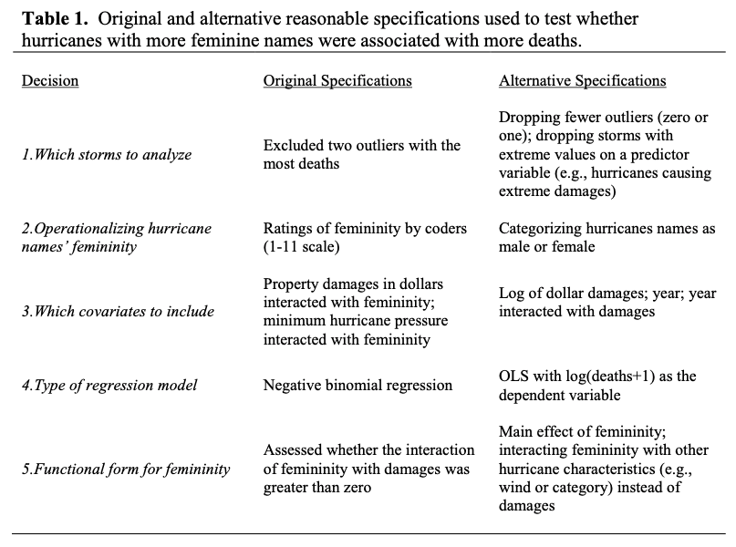
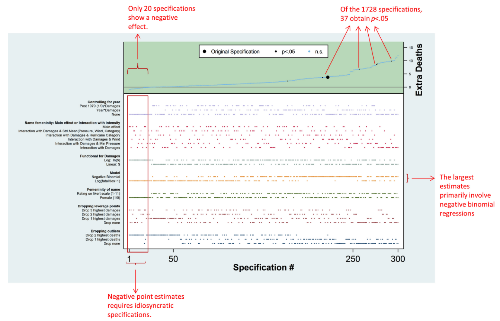
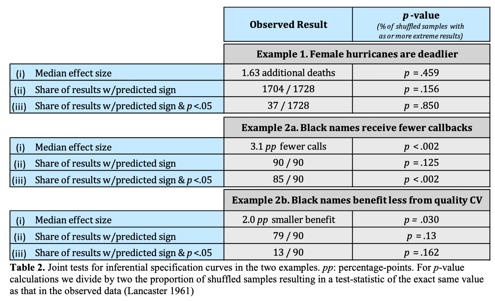
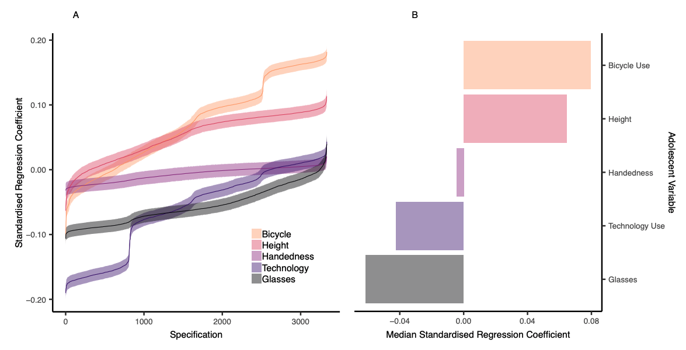

```{r setup, include=FALSE}
knitr::opts_chunk$set(echo = TRUE, message = FALSE, warning = FALSE)
```

# background
* The problem: there are many different wants to test a model and we usually only report one or a few specifications, which rely on choices by the researcher, which are often artbitrary and sometimes driven by a desire for significant results.
* The solution (according to Simonsohn, Simmons, & Nelson): specify all "reasonable" models and assess the distribution of effects


## steps for conducting SCA
1. Specify all reasonable models
2. Plot specification curve showing estimates/model fits as a function of analytic decisions or model parameters
3. Test how consistent the curve results are the null hypothesis (no effect)

## 1. Reasonable specifications should be:
  * Consistent with theory
  * Expected to be statistically valid
  * Non-redundant
    


## 2. Descriptive specification curve



## 3. Inferential statistics
  * Use permutation testing to run many specification curve analyses and create null distribution
  * Potential questions to test versus null:
      * Is the median effect size in the observed statistically different than in the null distribution?
      * Is the share of dominant signs (e.g., positive or negative effects) different than the null?
      * Is the share of dominant signs that are statistically significant different than the null?
        


* Also possible to compare specification surves between two variables of interest



# examples
* [Run All the Models! Dealing With Data Analytic Flexibility - Julia Rohrer](https://www.psychologicalscience.org/observer/run-all-the-models-dealing-with-data-analytic-flexibility)
* [The association between adolescent well-being and digital technology use - Orben  & Przybylski, 2019](https://www.amyorben.com/pdf/2019_orbenprzybylski_nhb.pdf)
* [Screens, Teens, and Psychological Well-Being: Evidence From Three Time-Use-Diary Studies - Orben  & Przybylski, 2019](https://www.amyorben.com/pdf/2019_orbenprzybylski_ps.pdf)

# reading list
* [Specification Curve: Descriptive and Inferential Statistics on All Reasonable Specifications - Simonsohn, Simmons, & Nelson, 2015](https://papers.ssrn.com/sol3/papers.cfm?abstract_id=2694998)

# programming resources
* [EDUC 610, Functional Programming with R - Daniel Anderson](https://uo-datasci-specialization.github.io/c3-fun_program_r/schedule.html)
* [R for Data Science - Grolemund & Wickham](https://r4ds.had.co.nz/many-models.html)

# load packages
```{r packages}
if (!require(tidyverse)) {
  install.packages('tidyverse')
}
if (!require(purrr)) {
  install.packages('purrr')
}
if (!require(broom)) {
  install.packages('broom')
}
if (!require(cowplot)) {
  install.packages('cowplot')
}
```

# run multiple models using `map` from `purrr`
```{r map}
# specify models
models = list(mpg ~ cyl,
              mpg ~ cyl + hp,
              mpg ~ cyl * hp)

# run models and extract parameter estimates and stats
(model_params = map(models, ~lm(.x,  data = mtcars)) %>%
  tibble() %>%
  rename("model" = ".") %>%
  mutate(tidied = purrr::map(model, broom::tidy),
         model_num = row_number()) %>%
  select(model_num, tidied) %>%
  unnest())

# run models and extract model fits
(model_fits = purrr::map(models, ~lm(.x,  data = mtcars)) %>%
  tibble() %>%
  rename("model" = ".") %>%
  mutate(model_num = row_number(),
         AIC = map_dbl(model, AIC),
         BIC = map_dbl(model, BIC)) %>%
  select(-model))

# join dataframes and select model fits and parameter estimates
model_params %>%
  select(model_num, term, estimate) %>%
  spread(term, estimate) %>%
  left_join(., model_fits) %>%
  arrange(AIC)
```

# run all nested models using `dredge` from `MuMIn`
* max number of predictors = 30
* doesn't give parameter estimates for factors
```{r dredge}
# set na.action for dredge
options(na.action = "na.fail")

# omit NAs
mtcars.na = mtcars %>% 
  na.omit()

# run full model
full.model = lm(mpg ~ cyl*hp, data = mtcars.na)

# run all possible nested models
(all.models = MuMIn::dredge(full.model, rank = "AIC", extra = "BIC"))
```

# issues with factors
## run factor models using `dredge`
```{r factors dredge}
# run full model
full.model = lm(mpg ~ cyl*as.factor(vs), data = mtcars.na)

# run all possible nested models
MuMIn::dredge(full.model, rank = "AIC", extra = "BIC") %>%
  select(AIC, BIC, everything())
```

## run factor models using `map`
```{r factors map}
# specify models
models = list(mpg ~ 1,
              mpg ~ cyl,
              mpg ~ as.factor(vs),
              mpg ~ cyl + as.factor(vs),
              mpg ~ cyl*as.factor(vs))

# run models and extract parameter estimates and stats
model_params = map(models, ~lm(.x,  data = mtcars)) %>%
  tibble() %>%
  rename("model" = ".") %>%
  mutate(tidied = purrr::map(model, broom::tidy),
         model_num = row_number()) %>%
  select(model_num, tidied) %>%
  unnest()

# run models and extract model fits
model_fits = purrr::map(models, ~lm(.x,  data = mtcars)) %>%
  tibble() %>%
  rename("model" = ".") %>%
  mutate(model_num = row_number(),
         AIC = map_dbl(model, AIC),
         BIC = map_dbl(model, BIC)) %>%
  select(-model)

# join dataframes and select model fits and parameter estimates
(models.sca = model_params %>%
  select(model_num, term, estimate) %>%
  spread(term, estimate) %>%
  left_join(., model_fits) %>%
  arrange(AIC)%>%
  select(AIC, BIC, everything()))
```

# plot specification curve
```{r specification curve}
# specify mpg ~ cyl as the null model for comparison
null.df = models.sca %>% 
  filter(model_num == 2)

# tidy for plotting
plot.data = models.sca %>%
  arrange(AIC) %>%
  mutate(specification = row_number(),
         better.fit = ifelse(AIC == null.df$AIC, "equal", 
                      ifelse(AIC < null.df$AIC, "yes","no")))

# get names of variables included in model
variable.names = names(select(plot.data, -model_num, -starts_with("better"), -specification, -AIC, -BIC))

# plot top panel
top = plot.data %>%
  ggplot(aes(specification, AIC, color = better.fit)) +
    geom_point(shape = "|", size = 4) +
    geom_hline(yintercept = null.df$AIC, linetype = "dashed", color = "lightblue") +
    scale_color_manual(values = c("lightblue", "black", "red")) +
    labs(x = "", y = "AIC\n") + 
    theme_minimal(base_size = 11) +
    theme(legend.title = element_text(size = 10),
          legend.text = element_text(size = 9),
          axis.text = element_text(color = "black"),
          axis.line = element_line(colour = "black"),
          legend.position = "none",
          panel.grid.major = element_blank(),
          panel.grid.minor = element_blank(),
          panel.border = element_blank(),
          panel.background = element_blank())

# plot bottom panel
bottom = plot.data %>%
  gather(variable, value, eval(variable.names)) %>% 
  mutate(value = ifelse(!is.na(value), "|", "")) %>%
  ggplot(aes(specification, variable, color = better.fit)) +
    geom_text(aes(label = value)) +
    scale_color_manual(values = c("lightblue", "black", "red")) +
    labs(x = "\nspecification number", y = "variables\n") + 
    theme_minimal(base_size = 11) +
    theme(legend.title = element_text(size = 10),
          legend.text = element_text(size = 9),
          axis.text = element_text(color = "black"),
          axis.line = element_line(colour = "black"),
          legend.position = "none",
          panel.grid.major = element_blank(),
          panel.grid.minor = element_blank(),
          panel.border = element_blank(),
          panel.background = element_blank())

# join panels
cowplot::plot_grid(top, bottom, ncol = 1, align = "v", labels = c('A', 'B'))
```

## reorder and rename variables
```{r clean up spec curve}
# set plotting order for variables based on number of times it's included in better fitting models
order = plot.data %>%
  arrange(AIC) %>%
  mutate(better.fit.num = ifelse(better.fit == "yes", 1, 0)) %>%
  rename("intercept" = `(Intercept)`,
         "vs" = `as.factor(vs)1`,
         "cyl x vs" = `cyl:as.factor(vs)1`) %>%
  gather(variable, value, -model_num, -starts_with("better"), -specification, -AIC, -BIC) %>% 
  filter(!is.na(value)) %>%
  group_by(variable) %>%
  mutate(order = sum(better.fit.num)) %>%
  select(variable, order) %>%
  unique()

# rename variables and plot bottom panel
bottom = plot.data %>%
  gather(variable, value, eval(variable.names)) %>% 
  mutate(value = ifelse(!is.na(value), "|", ""),
         variable = ifelse(variable == "(Intercept)", "intercept",
                    ifelse(variable == "as.factor(vs)1", "vs",
                    ifelse(variable == "cyl:as.factor(vs)1", "cyl x vs", variable)))) %>%
  left_join(., order, by = "variable") %>%
  ggplot(aes(specification, reorder(variable, order), color = better.fit)) +
    geom_text(aes(label = value)) +
    scale_color_manual(values = c("lightblue", "black", "red")) +
    labs(x = "\nspecification number", y = "variables\n") + 
    theme_minimal(base_size = 11) +
    theme(legend.title = element_text(size = 10),
          legend.text = element_text(size = 9),
          axis.text = element_text(color = "black"),
          axis.line = element_line(colour = "black"),
          legend.position = "none",
          panel.grid.major = element_blank(),
          panel.grid.minor = element_blank(),
          panel.border = element_blank(),
          panel.background = element_blank())

# join panels
cowplot::plot_grid(top, bottom, ncol = 1, align = "v", labels = c('A', 'B'))
```

# a more complicated example
## run all nested models using `dredge`
```{r complicated model}
# run full model
full.model = lm(mpg ~ cyl + disp + hp + drat + wt + qsec + as.factor(vs) + am + gear + carb, data = mtcars.na)

# run all possible nested models
models.sca = MuMIn::dredge(full.model, rank = "AIC", extra = "BIC")
```

## plot specification curve
```{r copmlicated spec curve, fig.width=10, fig.height=6}
# tidy for plotting
plot.data = models.sca %>%
  arrange(AIC) %>%
  mutate(specification = row_number(),
         better.fit = ifelse(AIC == null.df$AIC, "equal", 
                      ifelse(AIC < null.df$AIC, "yes","no"))) %>%
  gather(variable, value, -starts_with("better"), -specification, -AIC, -BIC, -df, -logLik, -delta, -weight) %>% 
  mutate(variable = gsub("[()]", "", variable),
         variable = gsub("Intercept", "intercept", variable),
         variable = gsub("as.factor(vs)", "vs", variable)) %>%
  spread(variable, value)

# get names of variables included in model
variable.names = names(select(plot.data, -starts_with("better"), -specification, -AIC, -BIC, -df, -logLik, -delta, -weight))

# plot top panel
top = plot.data %>%
  ggplot(aes(specification, AIC, color = better.fit)) +
    geom_point(shape = "|", size = 4) +
    geom_hline(yintercept = null.df$AIC, linetype = "dashed", color = "lightblue") +
    scale_color_manual(values = c("lightblue", "black", "red")) +
    labs(x = "", y = "AIC\n") + 
    theme_minimal(base_size = 11) +
    theme(legend.title = element_text(size = 10),
          legend.text = element_text(size = 9),
          axis.text = element_text(color = "black"),
          axis.line = element_line(colour = "black"),
          legend.position = "none",
          panel.grid.major = element_blank(),
          panel.grid.minor = element_blank(),
          panel.border = element_blank(),
          panel.background = element_blank())

# set plotting order for variables based on number of times it's included in better fitting models
order = plot.data %>%
  arrange(AIC) %>%
  mutate(better.fit.num = ifelse(better.fit == "yes", 1, 0)) %>%
  gather(variable, value, eval(variable.names)) %>% 
  filter(!is.na(value)) %>%
  group_by(variable) %>%
  mutate(order = sum(better.fit.num)) %>%
  select(variable, order) %>%
  unique()

# rename variables and plot bottom panel
bottom = plot.data %>%
  gather(variable, value, eval(variable.names)) %>% 
  mutate(value = ifelse(!is.na(value), "|", ""),
         variable = ifelse(variable == "(Intercept)", "intercept",
                    ifelse(variable == "as.factor(vs)1", "vs", variable))) %>%
  left_join(., order, by = "variable") %>%
  ggplot(aes(specification, reorder(variable, order), color = better.fit)) +
    geom_text(aes(label = value)) +
    scale_color_manual(values = c("lightblue", "black", "red")) +
    labs(x = "\nspecification number", y = "variables\n") + 
    theme_minimal(base_size = 11) +
    theme(legend.title = element_text(size = 10),
          legend.text = element_text(size = 9),
          axis.text = element_text(color = "black"),
          axis.line = element_line(colour = "black"),
          legend.position = "none",
          panel.grid.major = element_blank(),
          panel.grid.minor = element_blank(),
          panel.border = element_blank(),
          panel.background = element_blank())

# join panels
cowplot::plot_grid(top, bottom, ncol = 1, align = "v", labels = c('A', 'B'))
```

# coefficient specification curve
## mpg ~ wt
### extract coefficients
```{r coefficient models}
# extract parameter estimate (step-by-step output)
MuMIn::get.models(models.sca, subset = TRUE) %>%
  tibble() %>%
  rename("model" = ".")

MuMIn::get.models(models.sca, subset = TRUE) %>%
  tibble() %>%
  rename("model" = ".") %>%
  mutate(tidied = purrr::map(model, broom::tidy),
         model_num = row_number()) %>%
  select(model_num, tidied) %>%
  unnest()

# extract parameter estimate
(model_params = MuMIn::get.models(models.sca, subset = TRUE) %>%
  tibble() %>%
  rename("model" = ".") %>%
  mutate(tidied = purrr::map(model, broom::tidy),
         model_num = row_number()) %>%
  select(model_num, tidied) %>%
  unnest() %>%
  select(model_num, term, estimate) %>%
  spread(term, estimate))

# extract p-values for the intercept term
(model_ps = MuMIn::get.models(models.sca, subset = TRUE) %>%
  tibble() %>%
  rename("model" = ".") %>%
  mutate(tidied = purrr::map(model, broom::tidy),
         model_num = row_number()) %>%
  select(model_num, tidied) %>%
  unnest() %>%
  filter(term == "wt") %>%
  ungroup() %>%
  select(model_num, estimate, std.error, p.value))
```

### plot specification curve
```{r coefficient spec curve, fig.width=10, fig.height=6}
# merge and tidy for plotting
plot.data = left_join(model_ps, model_params, by = "model_num") %>%
  arrange(estimate) %>%
  mutate(specification = row_number(),
         significant.p = ifelse(p.value < .05, "yes", "no")) %>%
  gather(variable, value, -estimate, -specification, -model_num, -std.error, -p.value, -significant.p) %>% 
  mutate(variable = gsub("[()]", "", variable),
         variable = gsub("Intercept", "intercept", variable),
         variable = gsub("as.factor(vs)1", "vs", variable)) %>%
  spread(variable, value)  

# get names of variables included in model
variable.names = names(select(plot.data, -estimate, -specification, -model_num, -std.error, -p.value, -significant.p))

# plot top panel
top = plot.data %>%
  ggplot(aes(specification, estimate, color = significant.p)) +
    geom_point(shape = "|", size = 4) +
    #geom_hline(yintercept = null.df$AIC, linetype = "dashed", color = "lightblue") +
    scale_color_manual(values = c("black", "red")) +
    labs(x = "", y = "regression coefficient\n") + 
    theme_minimal(base_size = 11) +
    theme(legend.title = element_text(size = 10),
          legend.text = element_text(size = 9),
          axis.text = element_text(color = "black"),
          axis.line = element_line(colour = "black"),
          legend.position = "none",
          panel.grid.major = element_blank(),
          panel.grid.minor = element_blank(),
          panel.border = element_blank(),
          panel.background = element_blank())

# set plotting order for variables based on number of times it's included in better fitting models
order = plot.data %>%
  arrange(estimate) %>%
  mutate(significant.p.num = ifelse(significant.p == "yes", 1, 0)) %>%
  gather(variable, value, eval(variable.names)) %>% 
  filter(!is.na(value)) %>%
  group_by(variable) %>%
  mutate(order = sum(significant.p.num)) %>%
  select(variable, order) %>%
  unique()

# rename variables and plot bottom panel
bottom = plot.data %>%
  gather(variable, value, eval(variable.names)) %>% 
  mutate(value = ifelse(!is.na(value), "|", ""),
         variable = ifelse(variable == "(Intercept)", "intercept",
                    ifelse(variable == "as.factor(vs)1", "vs", variable))) %>%
  left_join(., order, by = "variable") %>%
  ggplot(aes(specification, reorder(variable, order), color = significant.p)) +
    geom_text(aes(label = value)) +
    scale_color_manual(values = c("black", "red")) +
    labs(x = "\nspecification number", y = "variables\n") + 
    theme_minimal(base_size = 11) +
    theme(legend.title = element_text(size = 10),
          legend.text = element_text(size = 9),
          axis.text = element_text(color = "black"),
          axis.line = element_line(colour = "black"),
          legend.position = "none",
          panel.grid.major = element_blank(),
          panel.grid.minor = element_blank(),
          panel.border = element_blank(),
          panel.background = element_blank())

# join panels
(wt = cowplot::plot_grid(top, bottom, ncol = 1, align = "v", labels = c('A', 'B')))
```

## mpg ~ cyl
### extract coefficients
```{r coefficient models cyl}
# extract p-values for the intercept term
model_ps = MuMIn::get.models(models.sca, subset = TRUE) %>%
  tibble() %>%
  rename("model" = ".") %>%
  mutate(tidied = purrr::map(model, broom::tidy),
         model_num = row_number()) %>%
  select(model_num, tidied) %>%
  unnest() %>%
  filter(term == "cyl") %>%
  ungroup() %>%
  select(model_num, estimate, std.error, p.value)
```

### plot specification curve
```{r coefficient spec curve cyl, fig.width=10, fig.height=6}
# merge and tidy for plotting
plot.data = left_join(model_ps, model_params, by = "model_num") %>%
  arrange(estimate) %>%
  mutate(specification = row_number(),
         significant.p = ifelse(p.value < .05, "yes", "no")) %>%
  gather(variable, value, -estimate, -specification, -model_num, -std.error, -p.value, -significant.p) %>% 
  mutate(variable = gsub("[()]", "", variable),
         variable = gsub("Intercept", "intercept", variable),
         variable = gsub("as.factor(vs)1", "vs", variable)) %>%
  spread(variable, value)  

# get names of variables included in model
variable.names = names(select(plot.data, -estimate, -specification, -model_num, -std.error, -p.value, -significant.p))

# plot top panel
top = plot.data %>%
  ggplot(aes(specification, estimate, color = significant.p)) +
    geom_point(shape = "|", size = 4) +
    #geom_hline(yintercept = null.df$AIC, linetype = "dashed", color = "lightblue") +
    scale_color_manual(values = c("black", "red")) +
    labs(x = "", y = "regression coefficient\n") + 
    theme_minimal(base_size = 11) +
    theme(legend.title = element_text(size = 10),
          legend.text = element_text(size = 9),
          axis.text = element_text(color = "black"),
          axis.line = element_line(colour = "black"),
          legend.position = "none",
          panel.grid.major = element_blank(),
          panel.grid.minor = element_blank(),
          panel.border = element_blank(),
          panel.background = element_blank())

# set plotting order for variables based on number of times it's included in better fitting models
order = plot.data %>%
  arrange(estimate) %>%
  mutate(significant.p.num = ifelse(significant.p == "yes", 1, 0)) %>%
  gather(variable, value, eval(variable.names)) %>% 
  filter(!is.na(value)) %>%
  group_by(variable) %>%
  mutate(order = sum(significant.p.num)) %>%
  select(variable, order) %>%
  unique()

# rename variables and plot bottom panel
bottom = plot.data %>%
  gather(variable, value, eval(variable.names)) %>% 
  mutate(value = ifelse(!is.na(value), "|", ""),
         variable = ifelse(variable == "(Intercept)", "intercept",
                    ifelse(variable == "as.factor(vs)1", "vs", variable))) %>%
  left_join(., order, by = "variable") %>%
  ggplot(aes(specification, reorder(variable, order), color = significant.p)) +
    geom_text(aes(label = value)) +
    scale_color_manual(values = c("black", "red")) +
    labs(x = "\nspecification number", y = "variables\n") + 
    theme_minimal(base_size = 11) +
    theme(legend.title = element_text(size = 10),
          legend.text = element_text(size = 9),
          axis.text = element_text(color = "black"),
          axis.line = element_line(colour = "black"),
          legend.position = "none",
          panel.grid.major = element_blank(),
          panel.grid.minor = element_blank(),
          panel.border = element_blank(),
          panel.background = element_blank())

# join panels and compare plots
(cyl = cowplot::plot_grid(top, bottom, ncol = 1, align = "v", labels = c('A', 'B')))
wt
```

# next steps
... Inferential statistics using specification curves!
... Plot standard errors!