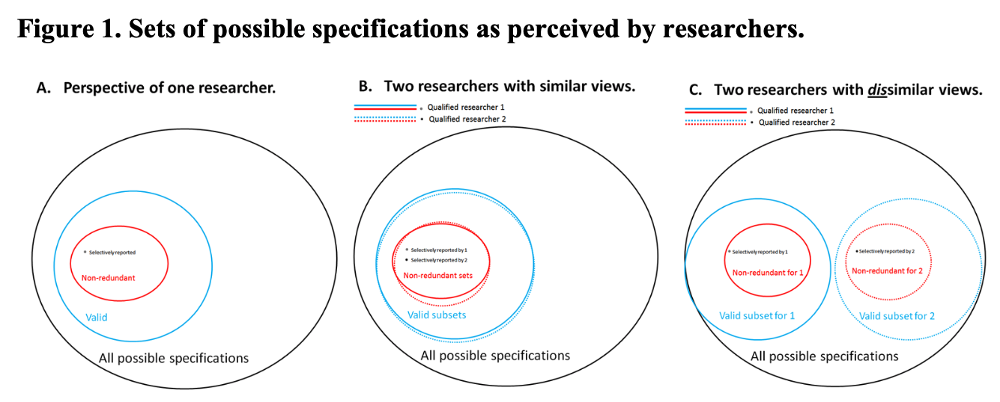
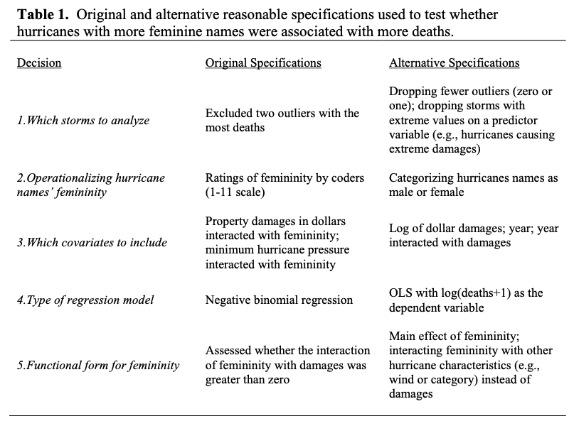
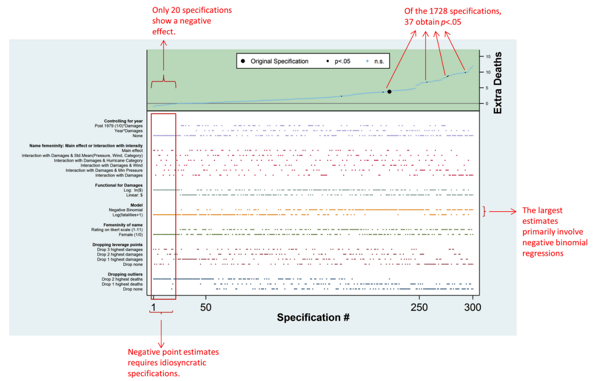
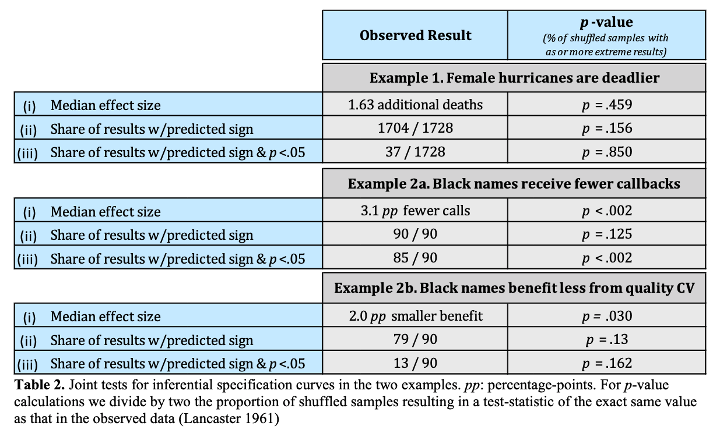
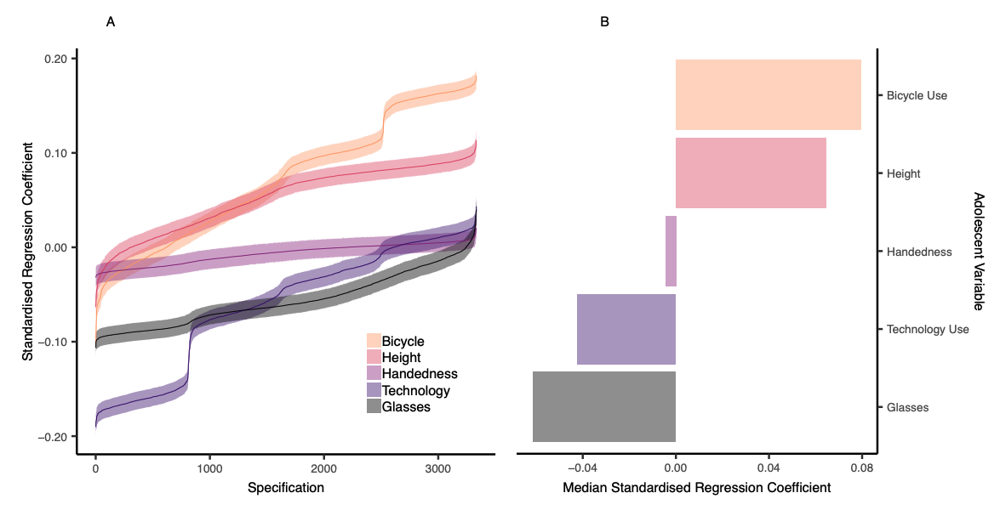

background
==========

-   The problem: there are many different wants to test a model and we usually only report one or a few specifications, which rely on choices by the researcher, which are often artbitrary and sometimes driven by a desire for significant results.
-   The solution (according to Simonsohn, Simmons, & Nelson): specify all "reasonable" models and assess the distribution of effects

 **Figure 1 Simonsohn, Simmons, & Nelson, 2015**

steps for conducting SCA
------------------------

1.  Specify all reasonable models
2.  Plot specification curve showing estimates/model fits as a function of analytic decisions or model parameters
3.  Test how consistent the curve results are the null hypothesis (no effect)

1. Reasonable specifications should be:
---------------------------------------

-   Consistent with theory
-   Expected to be statistically valid
-   Non-redundant

 **Table 1 Simonsohn, Simmons, & Nelson, 2015**

2. Descriptive specification curve
----------------------------------

 Figure 2 Simonsohn, Simmons, & Nelson, 2015

3. Inferential statistics
-------------------------

-   Use permutation testing to run many specification curve analyses and create null distribution
-   Potential questions to test versus null:
    -   Is the median effect size in the observed statistically different than in the null distribution?
    -   Is the share of dominant signs (e.g., positive or negative effects) different than the null?
    -   Is the share of dominant signs that are statistically significant different than the null?

 **Table 2 Simonsohn, Simmons, & Nelson, 2015**

-   Also possible to compare specification surves between two variables of interest

 **Figure 6 Orben & Przybylski, 2019**

examples
========

-   [Run All the Models! Dealing With Data Analytic Flexibility - Julia Rohrer](https://www.psychologicalscience.org/observer/run-all-the-models-dealing-with-data-analytic-flexibility)
-   [The association between adolescent well-being and digital technology use - Orben & Przybylski, 2019](https://www.amyorben.com/pdf/2019_orbenprzybylski_nhb.pdf)
-   [Screens, Teens, and Psychological Well-Being: Evidence From Three Time-Use-Diary Studies - Orben & Przybylski, 2019](https://www.amyorben.com/pdf/2019_orbenprzybylski_ps.pdf)

reading list
============

-   [Specification Curve: Descriptive and Inferential Statistics on All Reasonable Specifications - Simonsohn, Simmons, & Nelson, 2015](https://papers.ssrn.com/sol3/papers.cfm?abstract_id=2694998)

programming resources
=====================

-   [EDUC 610, Functional Programming with R - Daniel Anderson](https://uo-datasci-specialization.github.io/c3-fun_program_r/schedule.html)
-   [R for Data Science - Grolemund & Wickham](https://r4ds.had.co.nz/many-models.html)

load packages
=============

``` r
if (!require(tidyverse)) {
  install.packages('tidyverse')
}
if (!require(purrr)) {
  install.packages('purrr')
}
if (!require(broom)) {
  install.packages('broom')
}
if (!require(cowplot)) {
  install.packages('cowplot')
}
```

run multiple models using `map` from `purrr`
============================================

``` r
# specify models
models = list(mpg ~ cyl,
              mpg ~ cyl + hp,
              mpg ~ cyl * hp)

# run models and extract parameter estimates and stats
(model_params = map(models, ~lm(.x,  data = mtcars)) %>%
  tibble() %>%
  rename("model" = ".") %>%
  mutate(tidied = purrr::map(model, broom::tidy),
         model_num = row_number()) %>%
  select(model_num, tidied) %>%
  unnest())
```

    ## # A tibble: 9 x 6
    ##   model_num term        estimate std.error statistic  p.value
    ##       <int> <chr>          <dbl>     <dbl>     <dbl>    <dbl>
    ## 1         1 (Intercept)  37.9      2.07        18.3  8.37e-18
    ## 2         1 cyl          -2.88     0.322       -8.92 6.11e-10
    ## 3         2 (Intercept)  36.9      2.19        16.8  1.62e-16
    ## 4         2 cyl          -2.26     0.576       -3.93 4.80e- 4
    ## 5         2 hp           -0.0191   0.0150      -1.27 2.13e- 1
    ## 6         3 (Intercept)  50.8      6.51         7.79 1.72e- 8
    ## 7         3 cyl          -4.12     0.988       -4.17 2.67e- 4
    ## 8         3 hp           -0.171    0.0691      -2.47 1.99e- 2
    ## 9         3 cyl:hp        0.0197   0.00881      2.24 3.32e- 2

``` r
# run models and extract model fits
(model_fits = purrr::map(models, ~lm(.x,  data = mtcars)) %>%
  tibble() %>%
  rename("model" = ".") %>%
  mutate(model_num = row_number(),
         AIC = map_dbl(model, AIC),
         BIC = map_dbl(model, BIC)) %>%
  select(-model))
```

    ## # A tibble: 3 x 3
    ##   model_num   AIC   BIC
    ##       <int> <dbl> <dbl>
    ## 1         1  169.  174.
    ## 2         2  170.  175.
    ## 3         3  166.  174.

``` r
# join dataframes and select model fits and parameter estimates
model_params %>%
  select(model_num, term, estimate) %>%
  spread(term, estimate) %>%
  left_join(., model_fits) %>%
  arrange(AIC)
```

    ## # A tibble: 3 x 7
    ##   model_num `(Intercept)`   cyl `cyl:hp`       hp   AIC   BIC
    ##       <int>         <dbl> <dbl>    <dbl>    <dbl> <dbl> <dbl>
    ## 1         3          50.8 -4.12   0.0197  -0.171   166.  174.
    ## 2         1          37.9 -2.88  NA       NA       169.  174.
    ## 3         2          36.9 -2.26  NA       -0.0191  170.  175.

run all nested models using `dredge` from `MuMIn`
=================================================

-   max number of predictors = 30
-   doesn't give parameter estimates for factors

``` r
# set na.action for dredge
options(na.action = "na.fail")

# omit NAs
mtcars.na = mtcars %>% 
  na.omit()

# run full model
full.model = lm(mpg ~ cyl*hp, data = mtcars.na)

# run all possible nested models
(all.models = MuMIn::dredge(full.model, rank = "AIC", extra = "BIC"))
```

    ## Global model call: lm(formula = mpg ~ cyl * hp, data = mtcars.na)
    ## ---
    ## Model selection table 
    ##   (Int)    cyl       hp  cyl:hp   BIC df   logLik   AIC delta weight
    ## 8 50.75 -4.119 -0.17070 0.01974 173.6  5  -78.143 166.3  0.00  0.706
    ## 2 37.88 -2.876                  173.7  3  -81.653 169.3  3.02  0.156
    ## 4 36.91 -2.265 -0.01912         175.4  4  -80.781 169.6  3.28  0.137
    ## 3 30.10        -0.06823         185.6  3  -87.619 181.2 14.95  0.000
    ## 1 20.09                         211.7  2 -102.378 208.8 42.47  0.000
    ## Models ranked by AIC(x)

issues with factors
===================

run factor models using `dredge`
--------------------------------

``` r
# run full model
full.model = lm(mpg ~ cyl*as.factor(vs), data = mtcars.na)

# run all possible nested models
MuMIn::dredge(full.model, rank = "AIC", extra = "BIC") %>%
  select(AIC, BIC, everything())
```

    ##        AIC      BIC (Intercept) as.factor(vs)       cyl as.factor(vs):cyl
    ## 3 169.3064 173.7036    37.88458          <NA> -2.875790              <NA>
    ## 4 171.0585 176.9215    39.62502             + -3.090675              <NA>
    ## 8 172.1312 179.4598    36.92673             + -2.728218                 +
    ## 2 192.1471 196.5443    16.61667             +        NA              <NA>
    ## 1 208.7555 211.6870    20.09062          <NA>        NA              <NA>
    ##   df     logLik     delta       weight
    ## 3  3  -81.65321  0.000000 6.024117e-01
    ## 4  4  -81.52927  1.752124 2.508560e-01
    ## 8  5  -81.06558  2.824753 1.467257e-01
    ## 2  3  -93.07356 22.840708 6.608407e-06
    ## 1  2 -102.37776 39.449099 1.635424e-09

run factor models using `map`
-----------------------------

``` r
# specify models
models = list(mpg ~ 1,
              mpg ~ cyl,
              mpg ~ as.factor(vs),
              mpg ~ cyl + as.factor(vs),
              mpg ~ cyl*as.factor(vs))

# run models and extract parameter estimates and stats
model_params = map(models, ~lm(.x,  data = mtcars)) %>%
  tibble() %>%
  rename("model" = ".") %>%
  mutate(tidied = purrr::map(model, broom::tidy),
         model_num = row_number()) %>%
  select(model_num, tidied) %>%
  unnest()

# run models and extract model fits
model_fits = purrr::map(models, ~lm(.x,  data = mtcars)) %>%
  tibble() %>%
  rename("model" = ".") %>%
  mutate(model_num = row_number(),
         AIC = map_dbl(model, AIC),
         BIC = map_dbl(model, BIC)) %>%
  select(-model)

# join dataframes and select model fits and parameter estimates
(models.sca = model_params %>%
  select(model_num, term, estimate) %>%
  spread(term, estimate) %>%
  left_join(., model_fits) %>%
  arrange(AIC)%>%
  select(AIC, BIC, everything()))
```

    ## # A tibble: 5 x 7
    ##     AIC   BIC model_num `(Intercept)` `as.factor(vs)1`    cyl
    ##   <dbl> <dbl>     <int>         <dbl>            <dbl>  <dbl>
    ## 1  169.  174.         2          37.9           NA      -2.88
    ## 2  171.  177.         4          39.6           -0.939  -3.09
    ## 3  172.  179.         5          36.9            5.01   -2.73
    ## 4  192.  197.         3          16.6            7.94   NA   
    ## 5  209.  212.         1          20.1           NA      NA   
    ## # … with 1 more variable: `cyl:as.factor(vs)1` <dbl>

plot specification curve
========================

``` r
# specify mpg ~ cyl as the null model for comparison
null.df = models.sca %>% 
  filter(model_num == 2)

# tidy for plotting
plot.data = models.sca %>%
  arrange(AIC) %>%
  mutate(specification = row_number(),
         better.fit = ifelse(AIC == null.df$AIC, "equal", 
                      ifelse(AIC < null.df$AIC, "yes","no")))

# get names of variables included in model
variable.names = names(select(plot.data, -model_num, -starts_with("better"), -specification, -AIC, -BIC))

# plot top panel
top = plot.data %>%
  ggplot(aes(specification, AIC, color = better.fit)) +
    geom_point(shape = "|", size = 4) +
    geom_hline(yintercept = null.df$AIC, linetype = "dashed", color = "lightblue") +
    scale_color_manual(values = c("lightblue", "black", "red")) +
    labs(x = "", y = "AIC\n") + 
    theme_minimal(base_size = 11) +
    theme(legend.title = element_text(size = 10),
          legend.text = element_text(size = 9),
          axis.text = element_text(color = "black"),
          axis.line = element_line(colour = "black"),
          legend.position = "none",
          panel.grid.major = element_blank(),
          panel.grid.minor = element_blank(),
          panel.border = element_blank(),
          panel.background = element_blank())

# plot bottom panel
bottom = plot.data %>%
  gather(variable, value, eval(variable.names)) %>% 
  mutate(value = ifelse(!is.na(value), "|", "")) %>%
  ggplot(aes(specification, variable, color = better.fit)) +
    geom_text(aes(label = value)) +
    scale_color_manual(values = c("lightblue", "black", "red")) +
    labs(x = "\nspecification number", y = "variables\n") + 
    theme_minimal(base_size = 11) +
    theme(legend.title = element_text(size = 10),
          legend.text = element_text(size = 9),
          axis.text = element_text(color = "black"),
          axis.line = element_line(colour = "black"),
          legend.position = "none",
          panel.grid.major = element_blank(),
          panel.grid.minor = element_blank(),
          panel.border = element_blank(),
          panel.background = element_blank())

# join panels
cowplot::plot_grid(top, bottom, ncol = 1, align = "v", labels = c('A', 'B'))
```


reorder and rename variables
----------------------------

``` r
# set plotting order for variables based on number of times it's included in better fitting models
order = plot.data %>%
  arrange(AIC) %>%
  mutate(better.fit.num = ifelse(better.fit == "yes", 1, 0)) %>%
  rename("intercept" = `(Intercept)`,
         "vs" = `as.factor(vs)1`,
         "cyl x vs" = `cyl:as.factor(vs)1`) %>%
  gather(variable, value, -model_num, -starts_with("better"), -specification, -AIC, -BIC) %>% 
  filter(!is.na(value)) %>%
  group_by(variable) %>%
  mutate(order = sum(better.fit.num)) %>%
  select(variable, order) %>%
  unique()

# rename variables and plot bottom panel
bottom = plot.data %>%
  gather(variable, value, eval(variable.names)) %>% 
  mutate(value = ifelse(!is.na(value), "|", ""),
         variable = ifelse(variable == "(Intercept)", "intercept",
                    ifelse(variable == "as.factor(vs)1", "vs",
                    ifelse(variable == "cyl:as.factor(vs)1", "cyl x vs", variable)))) %>%
  left_join(., order, by = "variable") %>%
  ggplot(aes(specification, reorder(variable, order), color = better.fit)) +
    geom_text(aes(label = value)) +
    scale_color_manual(values = c("lightblue", "black", "red")) +
    labs(x = "\nspecification number", y = "variables\n") + 
    theme_minimal(base_size = 11) +
    theme(legend.title = element_text(size = 10),
          legend.text = element_text(size = 9),
          axis.text = element_text(color = "black"),
          axis.line = element_line(colour = "black"),
          legend.position = "none",
          panel.grid.major = element_blank(),
          panel.grid.minor = element_blank(),
          panel.border = element_blank(),
          panel.background = element_blank())

# join panels
cowplot::plot_grid(top, bottom, ncol = 1, align = "v", labels = c('A', 'B'))
```


a more complicated example
==========================

run all nested models using `dredge`
------------------------------------

``` r
# run full model
full.model = lm(mpg ~ cyl + disp + hp + drat + wt + qsec + as.factor(vs) + am + gear + carb, data = mtcars.na)

# run all possible nested models
models.sca = MuMIn::dredge(full.model, rank = "AIC", extra = "BIC")
```

plot specification curve
------------------------

``` r
# tidy for plotting
plot.data = models.sca %>%
  arrange(AIC) %>%
  mutate(specification = row_number(),
         better.fit = ifelse(AIC == null.df$AIC, "equal", 
                      ifelse(AIC < null.df$AIC, "yes","no"))) %>%
  gather(variable, value, -starts_with("better"), -specification, -AIC, -BIC, -df, -logLik, -delta, -weight) %>% 
  mutate(variable = gsub("[()]", "", variable),
         variable = gsub("Intercept", "intercept", variable),
         variable = gsub("as.factor(vs)", "vs", variable)) %>%
  spread(variable, value)

# get names of variables included in model
variable.names = names(select(plot.data, -starts_with("better"), -specification, -AIC, -BIC, -df, -logLik, -delta, -weight))

# plot top panel
top = plot.data %>%
  ggplot(aes(specification, AIC, color = better.fit)) +
    geom_point(shape = "|", size = 4) +
    geom_hline(yintercept = null.df$AIC, linetype = "dashed", color = "lightblue") +
    scale_color_manual(values = c("lightblue", "black", "red")) +
    labs(x = "", y = "AIC\n") + 
    theme_minimal(base_size = 11) +
    theme(legend.title = element_text(size = 10),
          legend.text = element_text(size = 9),
          axis.text = element_text(color = "black"),
          axis.line = element_line(colour = "black"),
          legend.position = "none",
          panel.grid.major = element_blank(),
          panel.grid.minor = element_blank(),
          panel.border = element_blank(),
          panel.background = element_blank())

# set plotting order for variables based on number of times it's included in better fitting models
order = plot.data %>%
  arrange(AIC) %>%
  mutate(better.fit.num = ifelse(better.fit == "yes", 1, 0)) %>%
  gather(variable, value, eval(variable.names)) %>% 
  filter(!is.na(value)) %>%
  group_by(variable) %>%
  mutate(order = sum(better.fit.num)) %>%
  select(variable, order) %>%
  unique()

# rename variables and plot bottom panel
bottom = plot.data %>%
  gather(variable, value, eval(variable.names)) %>% 
  mutate(value = ifelse(!is.na(value), "|", ""),
         variable = ifelse(variable == "(Intercept)", "intercept",
                    ifelse(variable == "as.factor(vs)1", "vs", variable))) %>%
  left_join(., order, by = "variable") %>%
  ggplot(aes(specification, reorder(variable, order), color = better.fit)) +
    geom_text(aes(label = value)) +
    scale_color_manual(values = c("lightblue", "black", "red")) +
    labs(x = "\nspecification number", y = "variables\n") + 
    theme_minimal(base_size = 11) +
    theme(legend.title = element_text(size = 10),
          legend.text = element_text(size = 9),
          axis.text = element_text(color = "black"),
          axis.line = element_line(colour = "black"),
          legend.position = "none",
          panel.grid.major = element_blank(),
          panel.grid.minor = element_blank(),
          panel.border = element_blank(),
          panel.background = element_blank())

# join panels
cowplot::plot_grid(top, bottom, ncol = 1, align = "v", labels = c('A', 'B'))
```


coefficient specification curve
===============================

mpg ~ wt
--------

### extract coefficients

``` r
# extract parameter estimate (step-by-step output)
MuMIn::get.models(models.sca, subset = TRUE) %>%
  tibble() %>%
  rename("model" = ".")
```

    ## # A tibble: 1,024 x 1
    ##    model   
    ##    <list>  
    ##  1 <S3: lm>
    ##  2 <S3: lm>
    ##  3 <S3: lm>
    ##  4 <S3: lm>
    ##  5 <S3: lm>
    ##  6 <S3: lm>
    ##  7 <S3: lm>
    ##  8 <S3: lm>
    ##  9 <S3: lm>
    ## 10 <S3: lm>
    ## # … with 1,014 more rows

``` r
MuMIn::get.models(models.sca, subset = TRUE) %>%
  tibble() %>%
  rename("model" = ".") %>%
  mutate(tidied = purrr::map(model, broom::tidy),
         model_num = row_number()) %>%
  select(model_num, tidied) %>%
  unnest()
```

    ## # A tibble: 6,144 x 6
    ##    model_num term        estimate std.error statistic    p.value
    ##        <int> <chr>          <dbl>     <dbl>     <dbl>      <dbl>
    ##  1         1 (Intercept)   9.62      6.96        1.38 0.178     
    ##  2         1 am            2.94      1.41        2.08 0.0467    
    ##  3         1 qsec          1.23      0.289       4.25 0.000216  
    ##  4         1 wt           -3.92      0.711      -5.51 0.00000695
    ##  5         2 (Intercept)  17.4       9.32        1.87 0.0721    
    ##  6         2 am            2.93      1.40        2.09 0.0458    
    ##  7         2 hp           -0.0176    0.0142     -1.25 0.223     
    ##  8         2 qsec          0.811     0.439       1.85 0.0757    
    ##  9         2 wt           -3.24      0.890      -3.64 0.00114   
    ## 10         3 (Intercept)  12.9       7.47        1.73 0.0958    
    ## # … with 6,134 more rows

``` r
# extract parameter estimate
(model_params = MuMIn::get.models(models.sca, subset = TRUE) %>%
  tibble() %>%
  rename("model" = ".") %>%
  mutate(tidied = purrr::map(model, broom::tidy),
         model_num = row_number()) %>%
  select(model_num, tidied) %>%
  unnest() %>%
  select(model_num, term, estimate) %>%
  spread(term, estimate))
```

    ## # A tibble: 1,024 x 12
    ##    model_num `(Intercept)`    am `as.factor(vs)1`    carb     cyl     disp
    ##        <int>         <dbl> <dbl>            <dbl>   <dbl>   <dbl>    <dbl>
    ##  1         1          9.62  2.94               NA  NA      NA     NA      
    ##  2         2         17.4   2.93               NA  NA      NA     NA      
    ##  3         3         12.9   3.51               NA  -0.489  NA     NA      
    ##  4         4         14.4   3.47               NA  NA      NA      0.0112 
    ##  5         5         38.8  NA                  NA  NA      -0.942 NA      
    ##  6         6          6.44  3.31               NA  NA      NA      0.00769
    ##  7         7         39.6  NA                  NA  -0.486  -1.29  NA      
    ##  8         8          9.92  2.96               NA  -0.602  NA     NA      
    ##  9         9         17.7   3.32               NA  -0.336  NA     NA      
    ## 10        10         14.9   2.47               NA  NA      -0.354 NA      
    ## # … with 1,014 more rows, and 5 more variables: drat <dbl>, gear <dbl>,
    ## #   hp <dbl>, qsec <dbl>, wt <dbl>

``` r
# extract p-values for the intercept term
(model_ps = MuMIn::get.models(models.sca, subset = TRUE) %>%
  tibble() %>%
  rename("model" = ".") %>%
  mutate(tidied = purrr::map(model, broom::tidy),
         model_num = row_number()) %>%
  select(model_num, tidied) %>%
  unnest() %>%
  filter(term == "wt") %>%
  ungroup() %>%
  select(model_num, estimate, std.error, p.value))
```

    ## # A tibble: 512 x 4
    ##    model_num estimate std.error    p.value
    ##        <int>    <dbl>     <dbl>      <dbl>
    ##  1         1    -3.92     0.711 0.00000695
    ##  2         2    -3.24     0.890 0.00114   
    ##  3         3    -3.43     0.820 0.000269  
    ##  4         4    -4.08     1.19  0.00208   
    ##  5         5    -3.17     0.741 0.000199  
    ##  6         6    -4.59     1.17  0.000529  
    ##  7         7    -3.16     0.742 0.000211  
    ##  8         8    -3.11     0.905 0.00199   
    ##  9         9    -3.08     0.925 0.00263   
    ## 10        10    -3.64     0.910 0.000436  
    ## # … with 502 more rows

### plot specification curve

``` r
# merge and tidy for plotting
plot.data = left_join(model_ps, model_params, by = "model_num") %>%
  arrange(estimate) %>%
  mutate(specification = row_number(),
         significant.p = ifelse(p.value < .05, "yes", "no")) %>%
  gather(variable, value, -estimate, -specification, -model_num, -std.error, -p.value, -significant.p) %>% 
  mutate(variable = gsub("[()]", "", variable),
         variable = gsub("Intercept", "intercept", variable),
         variable = gsub("as.factor(vs)1", "vs", variable)) %>%
  spread(variable, value)  

# get names of variables included in model
variable.names = names(select(plot.data, -estimate, -specification, -model_num, -std.error, -p.value, -significant.p))

# plot top panel
top = plot.data %>%
  ggplot(aes(specification, estimate, color = significant.p)) +
    geom_point(shape = "|", size = 4) +
    #geom_hline(yintercept = null.df$AIC, linetype = "dashed", color = "lightblue") +
    scale_color_manual(values = c("black", "red")) +
    labs(x = "", y = "regression coefficient\n") + 
    theme_minimal(base_size = 11) +
    theme(legend.title = element_text(size = 10),
          legend.text = element_text(size = 9),
          axis.text = element_text(color = "black"),
          axis.line = element_line(colour = "black"),
          legend.position = "none",
          panel.grid.major = element_blank(),
          panel.grid.minor = element_blank(),
          panel.border = element_blank(),
          panel.background = element_blank())

# set plotting order for variables based on number of times it's included in better fitting models
order = plot.data %>%
  arrange(estimate) %>%
  mutate(significant.p.num = ifelse(significant.p == "yes", 1, 0)) %>%
  gather(variable, value, eval(variable.names)) %>% 
  filter(!is.na(value)) %>%
  group_by(variable) %>%
  mutate(order = sum(significant.p.num)) %>%
  select(variable, order) %>%
  unique()

# rename variables and plot bottom panel
bottom = plot.data %>%
  gather(variable, value, eval(variable.names)) %>% 
  mutate(value = ifelse(!is.na(value), "|", ""),
         variable = ifelse(variable == "(Intercept)", "intercept",
                    ifelse(variable == "as.factor(vs)1", "vs", variable))) %>%
  left_join(., order, by = "variable") %>%
  ggplot(aes(specification, reorder(variable, order), color = significant.p)) +
    geom_text(aes(label = value)) +
    scale_color_manual(values = c("black", "red")) +
    labs(x = "\nspecification number", y = "variables\n") + 
    theme_minimal(base_size = 11) +
    theme(legend.title = element_text(size = 10),
          legend.text = element_text(size = 9),
          axis.text = element_text(color = "black"),
          axis.line = element_line(colour = "black"),
          legend.position = "none",
          panel.grid.major = element_blank(),
          panel.grid.minor = element_blank(),
          panel.border = element_blank(),
          panel.background = element_blank())

# join panels
(wt = cowplot::plot_grid(top, bottom, ncol = 1, align = "v", labels = c('A', 'B')))
```


mpg ~ cyl
---------

### extract coefficients

``` r
# extract p-values for the intercept term
model_ps = MuMIn::get.models(models.sca, subset = TRUE) %>%
  tibble() %>%
  rename("model" = ".") %>%
  mutate(tidied = purrr::map(model, broom::tidy),
         model_num = row_number()) %>%
  select(model_num, tidied) %>%
  unnest() %>%
  filter(term == "cyl") %>%
  ungroup() %>%
  select(model_num, estimate, std.error, p.value)
```

### plot specification curve

``` r
# merge and tidy for plotting
plot.data = left_join(model_ps, model_params, by = "model_num") %>%
  arrange(estimate) %>%
  mutate(specification = row_number(),
         significant.p = ifelse(p.value < .05, "yes", "no")) %>%
  gather(variable, value, -estimate, -specification, -model_num, -std.error, -p.value, -significant.p) %>% 
  mutate(variable = gsub("[()]", "", variable),
         variable = gsub("Intercept", "intercept", variable),
         variable = gsub("as.factor(vs)1", "vs", variable)) %>%
  spread(variable, value)  

# get names of variables included in model
variable.names = names(select(plot.data, -estimate, -specification, -model_num, -std.error, -p.value, -significant.p))

# plot top panel
top = plot.data %>%
  ggplot(aes(specification, estimate, color = significant.p)) +
    geom_point(shape = "|", size = 4) +
    #geom_hline(yintercept = null.df$AIC, linetype = "dashed", color = "lightblue") +
    scale_color_manual(values = c("black", "red")) +
    labs(x = "", y = "regression coefficient\n") + 
    theme_minimal(base_size = 11) +
    theme(legend.title = element_text(size = 10),
          legend.text = element_text(size = 9),
          axis.text = element_text(color = "black"),
          axis.line = element_line(colour = "black"),
          legend.position = "none",
          panel.grid.major = element_blank(),
          panel.grid.minor = element_blank(),
          panel.border = element_blank(),
          panel.background = element_blank())

# set plotting order for variables based on number of times it's included in better fitting models
order = plot.data %>%
  arrange(estimate) %>%
  mutate(significant.p.num = ifelse(significant.p == "yes", 1, 0)) %>%
  gather(variable, value, eval(variable.names)) %>% 
  filter(!is.na(value)) %>%
  group_by(variable) %>%
  mutate(order = sum(significant.p.num)) %>%
  select(variable, order) %>%
  unique()

# rename variables and plot bottom panel
bottom = plot.data %>%
  gather(variable, value, eval(variable.names)) %>% 
  mutate(value = ifelse(!is.na(value), "|", ""),
         variable = ifelse(variable == "(Intercept)", "intercept",
                    ifelse(variable == "as.factor(vs)1", "vs", variable))) %>%
  left_join(., order, by = "variable") %>%
  ggplot(aes(specification, reorder(variable, order), color = significant.p)) +
    geom_text(aes(label = value)) +
    scale_color_manual(values = c("black", "red")) +
    labs(x = "\nspecification number", y = "variables\n") + 
    theme_minimal(base_size = 11) +
    theme(legend.title = element_text(size = 10),
          legend.text = element_text(size = 9),
          axis.text = element_text(color = "black"),
          axis.line = element_line(colour = "black"),
          legend.position = "none",
          panel.grid.major = element_blank(),
          panel.grid.minor = element_blank(),
          panel.border = element_blank(),
          panel.background = element_blank())

# join panels and compare plots
(cyl = cowplot::plot_grid(top, bottom, ncol = 1, align = "v", labels = c('A', 'B')))
```


``` r
wt
```


next steps
==========

... Inferential statistics using specification curves!
... Plot standard errors!
