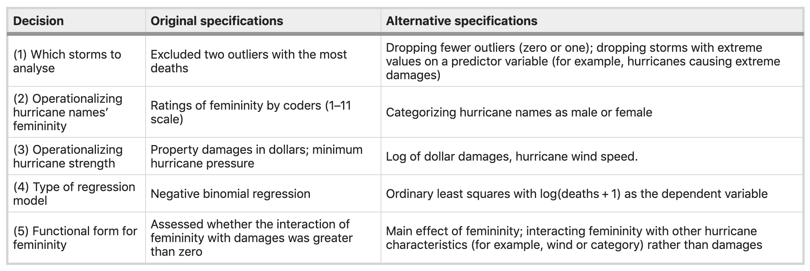

```{r setup, include=FALSE, warning=FALSE, message=FALSE}
options(htmltools.dir.version = FALSE)

# load packages
if (!require(pacman)) {
  install.packages('pacman')
}

pacman::p_load(devtools, tidyverse, purrr, broom, cowplot, igraph, ggraph, install = TRUE)

if(!require('xaringanExtra')) {
	devtools::install_github("gadenbuie/xaringanExtra")
}
if(!require('specr')) {
	devtools::install_github("masurp/specr")
}

xaringanExtra::use_xaringan_extra(include = c("panelset"))
```

## The reproducibility crisis

.pull-left[

* Attempted to replicate 100 published studies based on the original materials using high powered designs

* The mean replication effect size was **half the magnitude** (*M* = 0.20, *SD* = 0.26)

* **36%** of replication results were statistically significant (versus 97% of the original studies)

* **39%** of the replications were subjectively rated as replicating the original result
]

.pull-right[
```{r out.width = '100%', echo = FALSE}
knitr::include_graphics("img/replication_OSC.jpeg")
```
]

.footnote[`r emo::ji("link")` [Estimating the reproducibility of psychological science | Open Science Collaboration](https://www.science.org/doi/10.1126/science.aac4716)]

---
## Undisclosed analytic flexibility

.center[
```{r out.width = '60%', echo = FALSE}
knitr::include_graphics("https://www.si.umich.edu/sites/default/files/styles/hero_image_medium/public/image1.jpg?itok=yIJOsKAv")
```

.caption[
Graphic from: [Ditch the stale PDF](https://www.si.umich.edu/about-umsi/news/ditch-stale-pdf-making-research-papers-interactive-and-more-transparent)
]
]

<br>

.pull-left[
#### Problems
* The "garden of forking paths"

* "Researcher degrees of freedom"

]

--

.pull-right[
#### Solutions
* Preregistration

* Specification curve analysis

]


.footnote[`r emo::ji("link")` [Gelman & Loken, 2013](http://stat.columbia.edu/~gelman/research/unpublished/forking.pdf)]

---
## Specification curve analysis (SCA)

--

According to [Simonsohn, Simmons, & Nelson, 2020](https://www.nature.com/articles/s41562-020-0912-z), the solution is to specify all "reasonable" models to test an association and assess the joint distribution across model specifications.

--

<br>
.small[
> Some researchers object to blindly running alternative specifications that may make little sense for theoretical or statistical reasons just for the sake of ‘robustness’... We believe one should test specifications that vary in as many of the potentially ad hoc assumptions as possible without testing any specifications that are not theoretically grounded.
]

--

<br>
This can be thought of as an explicit framework for sensitivity analyses / robustness checks, that enables inferential statistics across model specifications.


---
## The value

Increased transparency.

--

A better understanding of how conceptual and analytic decisions alter the association of interest.

--

A more robust scientific literature with **increased replicability, generalizability, and translational value**.

--

.center[
```{r echo = FALSE, out.width="50%"}
knitr::include_graphics("https://media.giphy.com/media/WUq1cg9K7uzHa/giphy.gif")
```
]

---

## SCA overview

--
### 1. Specify all reasonable models

--

### 2. Plot specification curve showing association/effect estimates as a function of decisions

--

### 3. Test how inconsistent the curve results are given the null hypothesis of no association/effect

---

## 1. Identify reasonable models
For the relationship of interest, determine the set of reasonable model specifications to test.

--

#### Reasonable specifications should be:
+ Consistent with theory
+ Expected to be statistically valid
+ Non-redundant

.center[
```{r echo = FALSE, out.width="70%"}

```

.caption[
Table from [Simonsohn, Simmons, & Nelson, 2020](https://www.nature.com/articles/s41562-020-0912-z)
]
]

---

## 1. Identify reasonable models

**Type E decisions**  
* Alternative specifications are expected to be **equivalent** and thus can be treated as arbitrary
* Include in the SCA

**Type N decisions**  
* Alternative specifications **non-equivalent** (e.g. due to lower reliability or validity) and therefore some specifications can be treated as objectively better justified
* Don't include clearly worse specifications in the SCA

**Type U decisions**  
* It is **uncertain** whether alternative specifications are non-equivalent
* Treat SCA as exploratory
* Potentially break into separate curves when estimating curve stats

.footnote[`r emo::ji("link")` [Del Giudice & Gangestad, 2021](https://journals.sagepub.com/doi/full/10.1177/2515245920954925)]

---
## 2. Descriptive specification curve
The specification curve visualizes the strength of the association/effect between two constructs of interest across model specifications and the analytic decisions associated with each model specification.

--

.pull-left[
**Key features**
* Two panels depicting 1) the curve and 2) the decisions
* A vertical slice = information about a single model specification
]


.pull-right[
```{r echo = FALSE, out.width="100%"}
knitr::include_graphics("https://media.springernature.com/full/springer-static/image/art%3A10.1038%2Fs41562-020-0912-z/MediaObjects/41562_2020_912_Fig2_HTML.png")
```

.caption[
Figure from [Simonsohn, Simmons, & Nelson, 2020](https://www.nature.com/articles/s41562-020-0912-z)
]
]

---

## 2. Descriptive specification curve

--

#### The curve
* Model specifications are ranked

--

* Shows the model magnitude, sign (positive or negative), and statistical significance

--

* Often visualizes uncertainty around individual point estimates in the model specifications

--

* May highlight a single a priori or previously reported association/effect estimates

--

#### The decisions

--

* Each row denotes a specific decision and whether or not that decision applied to a given model specification

--

* Decisions are often grouped into categories to ease interpretation

---

## SCA examples

.panelset[
.panel[.panel-name[Simonsohn et al., 2020]
```{r echo = FALSE, out.width="70%", fig.align = "center"}
knitr::include_graphics("https://media.springernature.com/full/springer-static/image/art%3A10.1038%2Fs41562-020-0912-z/MediaObjects/41562_2020_912_Fig2_HTML.png")
```

.caption[Figure from [Simonsohn, Simmons, & Nelson, 2020](https://www.nature.com/articles/s41562-020-0912-z)
]
]

.panel[.panel-name[Orben & Przybylski, 2019]
```{r echo = FALSE, out.width="52%", fig.align = "center"}
knitr::include_graphics("https://media.springernature.com/full/springer-static/image/art%3A10.1038%2Fs41562-018-0506-1/MediaObjects/41562_2018_506_Fig3_HTML.png")
```

.caption[Example specification curve analysis (SCA) from [Orben  & Przybylski, 2019](http://nature.com/articles/s41562-018-0506-1)
]
]

.panel[.panel-name[Flournoy et al., 2020]
```{r echo = FALSE, out.width="52%", fig.align = "center"}
knitr::include_graphics("https://ars.els-cdn.com/content/image/1-s2.0-S1878929320300554-gr1.jpg")
```

.caption[Example specification curve analysis (SCA) from [Flournoy et al., 2020](https://www.sciencedirect.com/science/article/pii/S1878929320300554)
]
]

.panel[.panel-name[Cosme & Lopez, 2020]
```{r echo = FALSE, out.width="57%", fig.align = "center"}
knitr::include_graphics("https://oup.silverchair-cdn.com/oup/backfile/Content_public/Journal/scan/PAP/10.1093_scan_nsaa155/2/nsaa155f1.jpeg?Expires=1652231337&Signature=bF-qwPQM2uk9U4ax9HcovP1UD5hfZarY7pDGZDfmV5cDwPYq~YWLDiHvpfoQtN0FwieSOYIMk1n5mLuS57oG36-atTuf9653INkwoEjrNge86E3dEqdzor~D3yhurWGE09vsuqLlm8M3TDr8IrFuujWzjFIGTWoVhxRW3zwt3cM1yzizhBTHZDmYCGInJXbQPQUFdrSYakpuRjTj8kj8RkkMWlnW4w3zRJrr0854Zvm4TobGS-IYDBTIRy9uBo35A9vt3h6-t2qWCC7tiTUi3xvIPxDiUIvOFFuLMO09~OdLSyFaMSpSxfwaD8fdKpaNfTlUPelvjsgdWkficjbIyQ__&Key-Pair-Id=APKAIE5G5CRDK6RD3PGA")
```

.caption[Example specification curve analysis (SCA) from [Cosme & Lopez](https://psyarxiv.com/23mu5)
]
]

.panel[.panel-name[Cosme et al., preprint]
<br>
```{r echo = FALSE, out.width="35%", fig.align = "center"}

```

.caption[Example specification curve analysis (SCA) from [Cosme et al., preprint](https://psyarxiv.com/9cxfj)
]
]
]

---

## 3. Inferential statistics
<br>
#### Metrics of interest in the observed curve

* Median curve estimate

--

* The share of positive or negative associations that are statistically significant

--

<br>
.center[
###But are the observed effects surprising given the null hypothesis?
]

---

## 3. Inferential statistics
#### Test inconsistency with the null

--

+ Use bootstrap resampling to create a distribution of curves under the null hypothesis

--

  + Experimental designs = shuffle the randomly assigned variable(s)
  
--

  + Observational designs = "force" the null by removing the effect of x on y for each observation and sample from this null dataset
  
--

+ Estimate the curve and extract the curve median, and share of positive/negative significant associations

--

+ Repeat many times to get a distribution 

--

+ Compare observed curve metrics to null curves to generate p-values

---
## 3. Inferential statistics
#### Potential questions to test versus null

--

+ Is the median effect size in the observed curve statistically different than in the null distribution?

--

+ Is the share of dominant signs (e.g., positive or negative effects) that are statistically significant different than the null?


```{r echo = FALSE, out.width="75%", fig.align="center"}
knitr::include_graphics("img/table2_2020.png")
```

.caption[Table from [Simonsohn, Simmons, & Nelson, 2020](https://www.nature.com/articles/s41562-020-0912-z)
]

---
class: center, middle

## Tutorial

---

## 1. Define reasonable specifications

<br><br><br>
.center[
## What is the relationship between mental health and satisfaction with life?
]

---
## 1. Define reasonable specifications
--

Ways of operationalizing of the IV "mental health"
* `CEDS10` = depression score on the CESD-10
* `GAD7` = anxiety score on the GAD-7
* `PANAS_negative_Affect` = negative affect score on the PANAS
* `PSS` = perceived stress score on the PSS

--

Control variables
* `age` = age
* `gender` = gender 
* `mother_edu` = maternal education

--

Analytic decisions
* Statistical modeling approach
  * Linear regression
* Outliers
  * Use all data points
  * Winsorize to the mean +/- 3 SD

---
## 1. Define reasonable specifications

### Visualize decisions
```{r, echo = FALSE,  fig.width=10, fig.height=5, dpi=300}
# define model components
dvs = "SWLS"
analytic = c("winsorized yes", "winsorized no")
ivs = c("CESD10", "GAD7", "PANAS_negative_affect", "PSS")
control_vars = c("age", "gender", "mother_edu", "no covariates")

# define edges
l1 = expand.grid(from = dvs, to = analytic) %>%
  mutate(key = "winsorizing (yes / no)")
l2 = expand.grid(from = unique(l1$to), to = ivs) %>%
  group_by(to) %>%
  mutate(key = "independent variables",
         to = sprintf("%s_%s", to, row_number()))
l3 = expand.grid(from = unique(l2$to), to = control_vars) %>%
  group_by(to) %>%
  mutate(key = "control variables",
         to = sprintf("%s_%s", to, row_number()))
edge_list = bind_rows(l1, l2, l3)

# plot
decision_plot = igraph::graph_from_data_frame(edge_list)

ggraph::ggraph(decision_plot, layout = 'dendrogram', circular = FALSE) + 
  ggraph::geom_edge_diagonal(aes(color = key), strength = 0) +
  ggraph::scale_edge_color_manual(name = "decision key", values = wesanderson::wes_palette("Zissou1", 3, "continuous")) +
  theme_void() +
  theme(legend.position = "top")
```

---

## Prep data
These data are generated based on an existing dataset from a study looking at health and well-being 
* Create winsorized independent variables (+/- 3 SD from the mean)
* Mean center and standardize each variable

.scroll-output[ .extrasmall[
```{r, echo = TRUE, out.height="20px"}
# load data
df = read.csv("sca_tutorial_inferences_data.csv", stringsAsFactors = FALSE)

# tidy for modeling
model_df = df %>%
  gather(variable, value, -PID, -age, -gender, -mother_edu, -SWLS) %>%
  group_by(variable) %>%
  mutate(mean_value = mean(value, na.rm = TRUE),
         sd3 = 3*sd(value, na.rm = TRUE)) %>%
  ungroup() %>%
  mutate(value_winsorized = ifelse(value > mean_value + sd3, mean_value + sd3,
                            ifelse(value < mean_value - sd3, mean_value - sd3, value)),
         variable_winsorized = sprintf("%s_winsorized", variable)) %>%
  select(-mean_value, -sd3) %>%
  spread(variable_winsorized, value_winsorized) %>%
  group_by(PID) %>%
  fill(contains("winsorized"), .direction = "downup") %>%
  spread(variable, value) %>%
  gather(variable, value, -PID, -age, -gender, -mother_edu) %>%
  group_by(variable) %>%
  mutate(value = scale(value, center = TRUE, scale = TRUE)) %>%
  spread(variable, value) %>%
  select(PID, age, gender, mother_edu, SWLS, sort(tidyselect::peek_vars()))

```
]
]

---
## Prep data
These data are generated based on an existing dataset from a study looking at health and well-being 
* Create winsorized independent variables (+/- 3 SD from the mean)
* Mean center and standardize each variable

```{r, echo = FALSE}
model_df %>%
  mutate_if(is.numeric, ~round(., 2)) %>%
  DT::datatable(rownames = FALSE, extensions = 'FixedColumns',
                    options = list(scrollX = TRUE,
                                   scrollY = TRUE,
                                   pageLength = 5,
                                   autoWidth = TRUE,
                                   fixedColumns = list(leftColumns = 1),
                                   dom = 'tp'))
```

---

## 2. Specify and estimate models

There are various methods for running a large number of model specifications.

<br>

Here, we'll look at one method using `{specr}`, but there are additional examples using `{MuMIn}` and `{purrr}` in the tutorial `.Rmd file`.

---

## Estimate models using `{specr}`

.panelset[
.panel[.panel-name[info]

#### Advantages
* Very simple to use!
* You can easily run the models in specific subsets of your data 

#### Disadvantages / limitations
* Need to adapt functions for deeper customization
]

.panel[.panel-name[code]
```{r specr, echo = TRUE}
dvs = "SWLS"
ivs = c("CESD10", "GAD7", "PANAS_negative_affect", "PSS",
        "CESD10_winsorized", "GAD7_winsorized", "PANAS_negative_affect_winsorized", "PSS_winsorized")
control_vars = c("age", "gender", "mother_edu")
model = "lm"
output_specr = run_specs(df = model_df,
                         y = dvs,
                         x = ivs,
                         controls = control_vars,
                         model = model,
                         subsets = NULL,
                         keep.results = TRUE)
```
]

.panel[.panel-name[output]
```{r, echo = FALSE, eval = TRUE}
output_specr %>%
  select(-res) %>%
  mutate_if(is.numeric, ~round(., 2)) %>%
  DT::datatable(rownames = FALSE, extensions = 'FixedColumns',
                    options = list(scrollX = TRUE,
                                   scrollY = TRUE,
                                   pageLength = 5,
                                   autoWidth = TRUE,
                                   dom = 'tp'))
```
]
]

.footnote[`r emo::ji("link")` [`{specr}` documentation](https://masurp.github.io/specr/)]

---

## 3. Plot specification curve
### SCA plot with `{specr}`

.panelset[
.panel[.panel-name[code]
```{r, eval = FALSE}
output_specr %>%
  mutate(winsorized = ifelse(grepl("winsorized", x), "yes", "no"),
         x = gsub("_winsorized", "", x)) %>%
  plot_specs(., choices = c("x", "winsorized", "controls"))
```
]
.panel[.panel-name[output]
```{r, echo = FALSE, fig.width=5.5, fig.height=6, fig.align="center", fig.retina = 2}
output_specr %>%
  mutate(winsorized = ifelse(grepl("winsorized", x), "yes", "no"),
         x = gsub("_winsorized", "", x)) %>%
  plot_specs(., choices = c("x", "winsorized", "controls"))
```
]
]

---

## 3. Plot specification curve
### Plot guide

.pull-left[.extrasmall[
Panel A
* X-axis = ordered model specifications
* Y-axis = standardized regression coefficient for the IV-DV relationship 
* Points = the standardized regression coefficient for a specific models
* Error bars = 95% confidence intervals around the point estimate

Panel B
* X-axis = ordered model specifications (the same as panel A)
* Y-axis (right) = analytic decision categories
* Y-axis (left) = specific analytic decisions within each category
* Lines = denote that a specific analytic decision was true for that model specification

Color key
* Red = regression coefficient was statistically significant values at p < .05
* Black/grey = regression coefficient was p > .05
]
]

.pull-right[
```{r, echo = FALSE, fig.width=6, fig.height=6.5, fig.align="center", fig.retina = 2}
output_specr %>%
  mutate(winsorized = ifelse(grepl("winsorized", x), "yes", "no"),
         x = gsub("_winsorized", "", x)) %>%
  plot_specs(., choices = c("x", "winsorized", "controls"))
```
]

---
## 3. Plot specification curve
### Homebrew SCA plot
.panelset[
.panel[.panel-name[code] .scroll-output[ .extrasmall[
```{r purrr spec curve, echo = TRUE}
aes = theme_minimal(base_size = 11) +
      theme(legend.title = element_text(size = 10),
          legend.text = element_text(size = 9),
          axis.text = element_text(color = "black"),
          axis.line = element_line(colour = "black"),
          legend.position = "none",
          panel.border = element_blank(),
          panel.background = element_blank())
colors = c("yes" = "#90BAC7", "no" = "black")
plot_data = output_specr %>%
  arrange(estimate) %>%
  mutate(specification = row_number(),
         winsorized = ifelse(grepl("winsorized", x), "yes", "no"),
         significant.p = ifelse(p.value < .05, "yes", "no"),
         x = gsub("_winsorized", "", x)) 
top = plot_data %>%
  ggplot(aes(specification, estimate, color = significant.p)) +
    geom_pointrange(aes(ymin = conf.low, ymax = conf.high), size = .5, shape = "", alpha = 1) +
    geom_point(size = .5) +
    scale_color_manual(values = colors) + 
    labs(x = "", y = "standardized\nregression coefficient\n") + 
    aes
bottom = plot_data %>%
  mutate(`mental health` = x) %>%
  gather(variable, value, `mental health`, controls, winsorized) %>%
  unique() %>%
  mutate(variable = factor(variable, levels = c("mental health", "winsorized", "controls"))) %>% 
  ggplot(aes(x = specification,
             y = value,
             color = significant.p)) +
    geom_point(aes(x = specification,
                   y = value),
               shape = 124,
               size = 5) +
    facet_grid(variable ~ 1, scales = "free_y", space = "free_y") +
    scale_color_manual(values = colors) + 
    labs(x = "\nspecification number", y = "") + 
    aes +
    theme(strip.text.x = element_blank())
```
]
]
]

.panel[.panel-name[output]
```{r, echo = FALSE, eval = TRUE, fig.width=5.5, fig.height=6, fig.align="center", fig.retina = 2}
# join panels
cowplot::plot_grid(top, bottom, ncol = 1, align = "v", axis = 'l',
                       labels = c('A', 'B'), rel_heights = c(.35, .65))
```
]
]

---
## 3. Plot specification curve
### Grouped by IV
.panelset[
.panel[.panel-name[code] .scroll-output[ .extrasmall[
```{r IV curve, echo = TRUE}
colors = c("CESD10" = "#005F73", "GAD7" = "#EE9B00",
           "PANAS_negative_affect" = "#9B2226", "PSS" = "#0A9396")
plot_data = output_specr %>%
  arrange(estimate) %>%
  mutate(specification = row_number(),
         winsorized = ifelse(grepl("winsorized", x), "yes", "no"),
         significant.p = ifelse(p.value < .05, "yes", "no"),
         x = gsub("_winsorized", "", x)) %>%
  group_by(x) %>%
  mutate(median = median(estimate, na.rm = TRUE))
top = plot_data %>%
  ggplot(aes(specification, estimate, color = x, alpha = significant.p)) +
    geom_pointrange(aes(ymin = conf.low, ymax = conf.high), size = .5, shape = "") +
    geom_point(size = .5) +
    geom_hline(aes(yintercept = median, color = x)) +
    scale_color_manual(values = colors) + 
    scale_alpha_manual(values = c(.5, 1)) +
    labs(x = "", y = "standardized\nregression coefficient\n") + 
    aes
bottom = plot_data %>%
  mutate(`mental health` = x) %>%
  gather(variable, value, `mental health`, controls, winsorized) %>%
  unique() %>%
  mutate(variable = factor(variable, levels = c("mental health", "winsorized", "controls"))) %>% 
  ggplot(aes(x = specification,
             y = value,
             color = x,
             alpha = significant.p)) +
    geom_point(shape = 124,
               size = 5) +
    facet_grid(variable ~ 1, scales = "free_y", space = "free_y") +
    scale_color_manual(values = colors) + 
    scale_alpha_manual(values = c(.5, 1)) +
    labs(x = "\nspecification number", y = "") + 
    aes +
    theme(strip.text.x = element_blank())
```
]
]
]

.panel[.panel-name[output]
```{r, echo = FALSE, eval = TRUE, fig.width=5.5, fig.height=6, fig.align="center", fig.retina = 2}
cowplot::plot_grid(top, bottom, ncol = 1, align = "v", axis = 'l',
                       labels = c('A', 'B'), rel_heights = c(.35, .65))
```
]
]

---

## 4. Inferential statistics

1. Run the SCA and extract the median, and the number of positive and negative statistically significant models

--

2. Use bootstrap resampling to create a distribution of curves under the null hypothesis

--

3. Generate p-values indicating how surprising the observed results are under the null hypothesis

---

## Null boostrap resampling

.panelset[
.panel[.panel-name[overview]

* Run SCA to retrieve associations between the independent and dependent variable in each model specification

* Extract the dataset for each model specification (which was saved as a model object `fit` in the data frame)

* Force the null on each specification by subtracting the effect of the independent variable of interest (b estimate * x) from the dependent variable (y_value) for each observation in the dataset

* For each bootstrap, sample with replacement from the null dataset and run all model specifications to generate a curve

* Extract median estimate, N positive & significant at p < .05, and N negative & significant p < .05

* Repeat process many times (e.g. 500 or 1000)

]
.panel[.panel-name[define functions]
* `run_boot_null` = wrapper function to run the bootstrapping procedure or load an existing output file

* `sca_boot_null` = function that runs the boostrapping procedure

* `summarize_sca` = function to summarize the observed specification curve

* `summarize_boot_null` = function to summarize the bootstrapped curves

```{r, echo = FALSE}
run_boot_null = function(sca_results, ivs, dvs, model, control_vars, n_samples, rerun = FALSE,
                         dir_path = getwd()) {
  
  # This function runs the forced null bootstrapping function (sca_null_boot) or loads in the RDS file if bootstrapping has already been run
  #
  # sca_results = SCA results object
  # ivs = the x variable(s) of interest
  # dvs = the y variable(s) of interest
  # control_vars = control variables
  # model = models to estimate (e.g. "lm")
  # n_samples = the number of samples
  # rerun = boolean stating whether or not to rerun the bootstrapping procedure if the file exists
  # dir_path = path to output directory
  
  if (rerun == FALSE & file.exists(sprintf("%s/boot/boot_null_%s.RDS", dir_path, dvs))) {
    out = readRDS(sprintf("%s/boot/boot_null_%s.RDS", dir_path, dvs))
  } else {
    out = sca_boot_null(sca_results = sca_results, ivs = ivs, dvs = dvs, control_vars = control_vars,
                        model = model, n_samples = n_samples)
    
    if (!file.exists(sprintf("%s/boot", dir_path))) {
      dir.create(sprintf("%s/boot", dir_path), recursive = TRUE)
    }
    
    saveRDS(out, sprintf("%s/boot/boot_null_%s.RDS", dir_path, dvs))
  }
  return(out)
}

sca_boot_null = function(sca_results, ivs, dvs, control_vars, model, group_vars = c("y"),
                         n_samples, conf.level = 0.95, seed = 63) {
  
  # This function creates a null dataset, reamples n_samples times, and estimates the specification curve for each sample
  #
  # sca_results = SCA results object
  # ivs = the x variable(s) of interest
  # dvs = the y variable(s) of interest
  # control_vars = control variables
  # model = models to estimate (e.g. "lm")
  # group_vars = variables indicating which variables (x, y, or x and y) to summarize the results by
  # n_samples = the number of samples
  # rerun = boolean stating whether or not to rerun the bootstrapping procedure if the file exists
  # dir_path = path to output directory
  
  # set seed
  set.seed(seed)
  
  # create null dataset by subtracting the effect of x (estimate * x) from the dependent variable (y_value)
  null_data = sca_results %>%
    rownames_to_column() %>%
    rename("model_number" = rowname) %>%
    group_by(model_number) %>%
    mutate(data = list(res[[1]][["model"]])) %>%
    select(-res) %>%
    unnest() %>%
    group_by(model_number) %>%
    mutate(obs_number = row_number()) %>%
    ungroup() %>%
    gather(dv, y_value, !!(dvs)) %>%
    gather(iv, iv_value, ivs) %>%
    filter(!is.na(iv_value)) %>%
    mutate(y_null = y_value - (estimate * iv_value)) %>%
    select(-y_value, -estimate) %>%
    spread(dv, y_null) %>%
    spread(iv, iv_value) %>%
    select(-c(std.error, statistic, p.value, conf.low, conf.high, obs, obs_number))
  
  # generate 
  boots = rsample::bootstraps(null_data, times = n_samples, apparent = FALSE)
  
  # define function
  fit_sca = function(split){
    
    # prep bootstrapped sample
    boot_data = rsample::analysis(split)
    
    # run sca
    results = run_specs(df = boot_data,
                        y = dvs, 
                        x = ivs,
                        controls = control_vars,
                        model = model, 
                        subsets = NULL)
    }
  
  # run function on each bootstrapped sample in boots
  boot_models = boots %>% 
    mutate(results = map(splits, fit_sca))
  
  # summarize results
  boot_summary = boot_models %>%
    select(-splits) %>%
    unnest() %>%
    group_by(id) %>%
    mutate(pos = ifelse(estimate > 0, 1, 0),
           neg = ifelse(estimate < 0, 1, 0),
           sig = ifelse(p.value < .05, 1, 0),
           pos_sig = ifelse(pos == 1 & sig == 1, 1, 0),
           neg_sig = ifelse(neg == 1 & sig == 1, 1, 0)) %>%
      group_by(id, !!as.name(group_vars)) %>%
      summarize(median = median(estimate),
                n = n(),
                n_positive_sig = sum(pos_sig),
                n_negative_sig = sum(neg_sig)) %>%
      ungroup()
  
  return(list(boot_models = boot_models, boot_summary = boot_summary))
  
}

summarize_sca = function(sca_results, group_vars = c("y")) {
  
  # This function summarizes the results from the SCA
  #
  # sca_results = SCA results object
  # group_vars = variables indicating which variables (x, y, or x and y) to summarize the results by
        
  summary = sca_results %>%
    mutate(pos = ifelse(estimate > 0, 1, 0),
           neg = ifelse(estimate < 0, 1, 0),
           sig = ifelse(p.value < .05, 1, 0),
           pos_sig = ifelse(pos == 1 & sig == 1, 1, 0),
           neg_sig = ifelse(neg == 1 & sig == 1, 1, 0)) %>%
    group_by(!!as.name(group_vars)) %>%
    summarize(obs_median = median(estimate),obs_n = n(),
              obs_n_positive_sig = sum(pos_sig),
              obs_n_negative_sig = sum(neg_sig)) %>%
    select(!!as.name(group_vars), obs_median, everything())
  
  return(summary)
}

summarize_boot_null = function(sca_summary, boot_null_summary, group_vars = c("y")) {
  
  # This function joins the observed SCA summary and the bootstrapping results to calculate p-values
  #
  # sca_summary = observed SCA summary
  # boot_null_summary = null bootstrapping summary
  
  summary = boot_null_summary %>%
    left_join(., sca_summary) %>%
    mutate(extreme_median = ifelse(obs_median > 0 & median >= obs_median, 1,
                            ifelse(obs_median < 0 & median <= obs_median, 1, 0)),
           extreme_positive_sig = ifelse(n_positive_sig >= obs_n_positive_sig, 1, 0),
           extreme_negative_sig = ifelse(n_negative_sig >= obs_n_negative_sig, 1, 0)) %>%
    group_by(!!as.name(group_vars)) %>%
    summarize(n = n(),
              extreme_median = sum(extreme_median),
              extreme_positive_sig = sum(extreme_positive_sig),
              extreme_negative_sig = sum(extreme_negative_sig)) %>%
    gather(variable, n_extreme, contains("extreme")) %>%
    mutate(p_value = n_extreme / n,
           p_value = ifelse(p_value == 1.000, "1.000",
                     ifelse(p_value < .001, "< .001", gsub("0.(.*)", ".\\1", sprintf("%.3f", p_value))))) %>%
    select(!!as.name(group_vars), variable, p_value) %>%
    spread(variable, p_value) %>%
    left_join(., sca_summary) %>%
    mutate(Mdn = sprintf("%.2f", obs_median),
           obs_n_positive_sig = sprintf("%s / %s", obs_n_positive_sig, obs_n),
           obs_n_negative_sig = sprintf("%s / %s", obs_n_negative_sig, obs_n)) %>% 
    select(y, Mdn, extreme_median, obs_n_positive_sig, extreme_positive_sig, obs_n_negative_sig, extreme_negative_sig) %>%
    rename("Mdn p" = extreme_median,
           "Positive share N" = obs_n_positive_sig,
           "Positive share p" = extreme_positive_sig,
           "Negative share N" = obs_n_negative_sig,
           "Negative share p" = extreme_negative_sig)
  
  return(summary)
}
```
]
.panel[.panel-name[bootstrap `specr` output]
```{r, echo=FALSE, eval = TRUE}
boot_results = run_boot_null(sca_results = output_specr, ivs = ivs, dvs = dvs, control_vars = control_vars,
              model = model, n_samples = 500)
```

```{r, echo = FALSE, eval = TRUE}
boot_results$boot_summary %>%
  mutate_if(is.numeric, ~round(., 2)) %>%
  DT::datatable(rownames = FALSE, extensions = 'FixedColumns',
                    options = list(scrollX = TRUE,
                                   scrollY = TRUE,
                                   pageLength = 5,
                                   fixedColumns = list(leftColumns = 1),
                                   dom = 'tp'))
```
]
]

---

## Generate inferential stats

.panelset[
.panel[.panel-name[curve metrics]

* Curve median

* Share of positive statistically significant associations at p < .05

* Share of negative statistically significant associations at p < .05

]
.panel[.panel-name[p-values]

These represent the number of times that an equally or more extreme value was observed in the bootstrapped null curve distribution (i.e. 1 / 500 = .002)

<br>

```{r, echo=FALSE, eval = TRUE, warning=FALSE, message=FALSE}
# summarize observed SCA
summary_sca = summarize_sca(sca_results = output_specr, group_vars = "y")

summarize_boot_null(sca_summary = summary_sca, boot_null_summary = boot_results$boot_summary, group_vars = "y") %>%
  knitr::kable(digits = 2)
```
]
]

---
class:center, middle

## Resources

---

.panelset[
.panel[.panel-name[Reading list]
* [Specification curve analysis - Simonsohn, Simmons, & Nelson, 2020](https://www.nature.com/articles/s41562-020-0912-z)

* [Increasing Transparency Through a Multiverse Analysis - Steegen et al., 2016](https://journals.sagepub.com/doi/10.1177/1745691616658637)

* [A Traveler’s Guide to the Multiverse: Promises, Pitfalls, and a Framework for the Evaluation of Analytic Decisions - Del Giudice & Gangestad, 2021](https://journals.sagepub.com/doi/full/10.1177/2515245920954925)
]

.panel[.panel-name[Example papers using SCA]
* [Run All the Models! Dealing With Data Analytic Flexibility - Julia Rohrer](https://www.psychologicalscience.org/observer/run-all-the-models-dealing-with-data-analytic-flexibility)

* [The association between adolescent well-being and digital technology use - Orben  & Przybylski, 2019](http://nature.com/articles/s41562-018-0506-1)

* [Screens, Teens, and Psychological Well-Being: Evidence From Three Time-Use-Diary Studies - Orben  & Przybylski, 2019](https://journals.sagepub.com/doi/10.1177/0956797619830329)

* [Age-related change in task-evoked amygdala-prefrontal circuitry: a multiverse approach with an accelerated longitudinal cohort aged 4-22 years - Bloom et al., preprint](https://www.biorxiv.org/content/10.1101/2021.10.08.463601v1)

* [Neural indicators of food cue reactivity, regulation, and valuation and their associations with body composition and daily eating behavior - Cosme & Lopez, 2020](https://psyarxiv.com/23mu5/)

* [Message self and social relevance increases intentions to share content: Correlational and causal evidence from six studies - Cosme et al., preprint](https://psyarxiv.com/9cxfj)

]

.panel[.panel-name[Shiny apps]
* [Amygdala multiverse explorer - Paul Bloom](https://pbloom.shinyapps.io/amygdala_mpfc_multiverse/)

* [SCA explorer - in progress](https://dcosme.shinyapps.io/explore-sca/)

]

.panel[.panel-name[Tutorials]
* [Amygdala multiverse walkthrough - Paul Bloom](https://pab2163.github.io/amygdala_mpfc_multiverse/into_the_bayesian_multiverse.html)

* [Specification curve analysis: A practice guide](https://dcosme.github.io/specification-curves/SCA_tutorial_inferential)

]
]

---

class:center, middle

# Thank you!

The repository can be found at:

[https://github.com/dcosme/specification-curves/](https://github.com/dcosme/specification-curves/)

---

