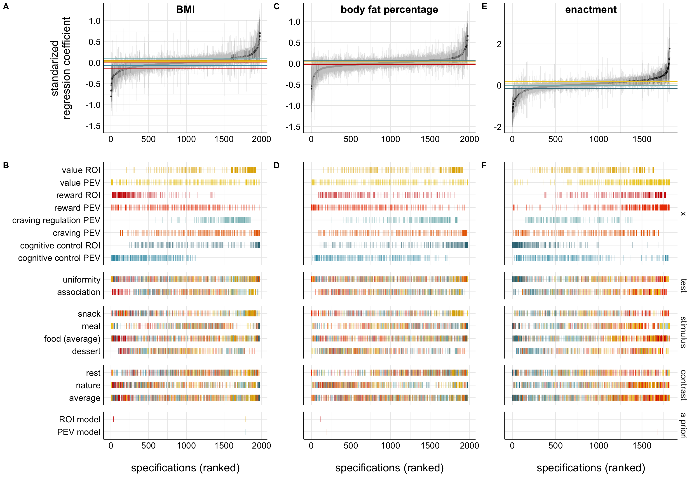
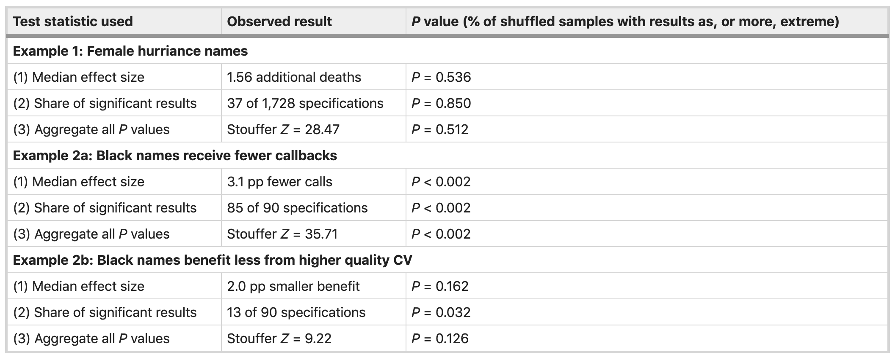
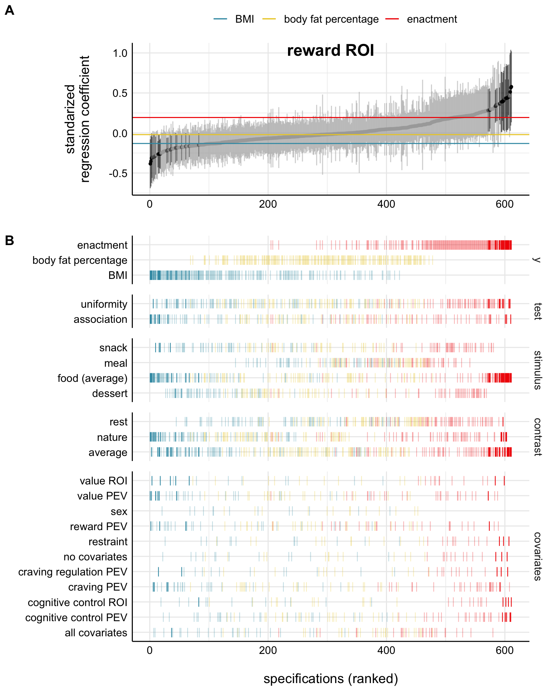
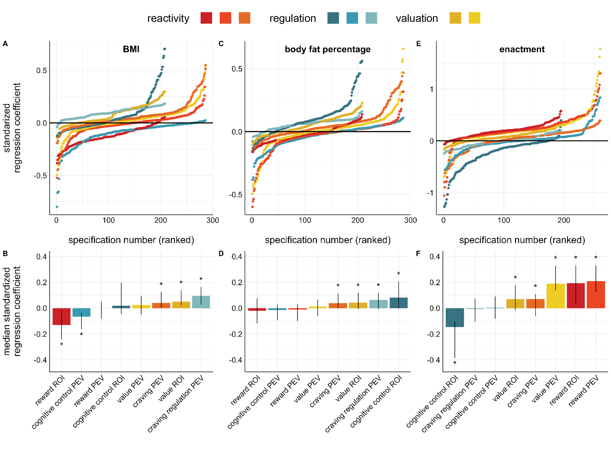

```{r setup, include=FALSE}
knitr::opts_chunk$set(echo = TRUE, message = FALSE, warning = FALSE)
options(scipen = 999)
```

<br><br>
This tutorial was presented at the University of Melbourne, September 29, 2020.

The repository can be found at: [https://github.com/dcosme/specification-curves/](https://github.com/dcosme/specification-curves/)

```{r, include = FALSE}
# load packages
if (!require(tidyverse)) {
  install.packages('tidyverse')
}
if (!require(purrr)) {
  install.packages('purrr')
}
if (!require(broom)) {
  install.packages('broom')
}
if (!require(cowplot)) {
  install.packages('cowplot')
}
if (!require(combinat)) {
  install.packages('combinat')
}
if (!require(igraph)) {
  install.packages('igraph')
}
if (!require(ggraph)) {
  install.packages('ggraph')
}
if (!require(devtools)) {
  install.packages('devtools')
}
devtools::install_github("masurp/specr") #devtools::install_github("dcosme/specr", ref = "plotmods")
library(specr)
```


# Background {.tabset}
## The problem

There are many different ways to test a given association and we usually only report one or a few model specifications.

Model selection relies on choices by the researcher, and these choices are often arbitrary and sometimes driven by a desire for significant results.

Given the same dataset, two researchers might choose to answer the same question in very different ways.

<br><br>


Figure from [Simonsohn, Simmons, & Nelson, 2020](https://www.nature.com/articles/s41562-020-0912-z)


## The solution

According to [Simonsohn, Simmons, & Nelson, 2020](https://papers.ssrn.com/sol3/papers.cfm?abstract_id=2694998)), the solution is to specify all "reasonable" models to test an association and assess the joint distribution across model specifications.

> Some researchers object to blindly running alternative specifications that may make little sense for theoretical or statistical reasons just for the sake of ‘robustness’. We are among those researchers. We believe one should test specifications that vary in as many of the potentially ad hoc assumptions as possible without testing any specifications that are not theoretically grounded.

This can be thought of as an explicit framework for sensitivity analyses / robustness checks, that enables inferential statistics across model specifications.


## The value

A better understanding of how conceptual and analytic decisions alter the association of interest.

A more robust scientific literature with increased generalizability and translational value.

<br>


# SCA overview {.tabset}
1. Specify all reasonable models
2. Plot specification curve showing association/effect estimates as a function of decisions
3. Test how inconsistent the curve results are given the null hypothesis of no association/effect

<br><br>

## 1. Identify reasonable models
For the relationship of interest (e.g. relationship between storm name gender and death toll), determine the set of reasonable model specifications to test.

<br>

#### Reasonable specifications should be:

* Consistent with theory
* Expected to be statistically valid
* Non-redundant

<br>

Table from [Simonsohn, Simmons, & Nelson, 2020](https://www.nature.com/articles/s41562-020-0912-z)


## 2. Descriptive specification curve
The specification curve visualizes the strength of the association/effect between two constructs of interest across model specifications and the analytic decisions associated with each model specification.

<br> 

#### Key features

* Two panels depicting 1) the curve of associations/effect estimates and 2) the decisions
* Taking a vertical slice will tell you about a single model specification
* The curve
  * Model specifications are ranked to highlight the distribution of associations/effect estimates
  * Shows the magnitude, sign (positive or negative), and statistical significance of the association/effect in each model specification
  * Often visualizes uncertainty around individual point estimates in the model specifications
  * May highlight a single a priori or previously reported association/effect estimates
* The decisions
  * Each row denotes a specific decision and whether or not that decision applied to a given model specification
  * Decisions are often grouped into categories to ease interpretation

<br>

#### SCA examples {.tabset}
##### Simonsohn et al., 2020
Figure from [Simonsohn, Simmons, & Nelson, 2020](https://www.nature.com/articles/s41562-020-0912-z)

<br>


##### Orben  & Przybylski, 2019
Example specification curve analysis (SCA) from [Orben  & Przybylski, 2019](http://nature.com/articles/s41562-018-0506-1)

<br>


##### Cosme & Lopez, in revision
Example specification curve analysis (SCA) from [Cosme & Lopez](https://psyarxiv.com/23mu5)

<br>


##### Cosme et al., 2020
Example specification curve analysis (SCA) from [Cosme et al., 2020](https://academic.oup.com/scan/advance-article/doi/10.1093/scan/nsaa002/5716615)

<br>


## 3. Inferential statistics
#### Curve metrics of interest

* Median effect size in the observed the curve
* The share of positive or negative associations that are statistically significant

<br>

#### Generating a null distribution of curves

To assess how surprising or inconsistent the observed curve effects are given the null hypothesis that there is no effect, use bootstrap resampling to generate a null distribution of curves, and compare the observed results to the results from the null distribution.

For experimental designs, resampling is done by repeatedly shuffling the randomly assigned variable(s) to remove the association between them and the outcome.

For observational designs, create a null dataset by removing the effect of x on y (i.e. "forcing" the null) for each observation, and sample repeatedly with replacement from this dataset.

For each resample, estimate each model specification to form a curve. From the curve, extract the median and the number of positive and negative statistically significant models.

After resampling a large number of times (e.g. 500 or 1000), you will have a distribution of curve metrics when the null is true. 
To generate p-values assessing how inconsistent the observed results with the null hypothesis that there is no effect, count the number of samples in which the curve metrics (e.g. the curve median) were equally or more extreme than the observed metrics.

<br>

#### Potential questions to test versus null

* Is the median effect size in the observed curve statistically different than in the null distribution?
* Is the share of dominant signs (e.g., positive or negative effects) that are statistically significant different than the null?

<br>

Table from [Simonsohn, Simmons, & Nelson, 2020](https://www.nature.com/articles/s41562-020-0912-z)


# Tutorial
## 1. Define reasonable specifications {.tabset}

### Specify analytic decisions
#### Research question
What is the relationship between mental health and satisfaction with life?

<br>

#### Ways of operationalizing of the IV "mental health"

* `CEDS10` = mean depression score on the CESD-10
* `GAD` = summed anxiety score on the GAD-7
* `PANAS_negative_Affect` = mean negative affect score on the PANAS-X
* `PS` = summed perceived stress score on the PSS

<br>

#### Control variables

* `age` = age
* `gender` = gender 
* `mother_edu` = maternal education

<br>

#### Analytic decisions

* Statistical modeling approach
  * Linear regression
* Outliers
  * Use all data points
  * Winsorize to the mean +/- 3 SD

### Visualize decisions
```{r}
# define model components
dvs = "SWLS"
analytic = c("winsorized yes", "winsorized no")
ivs = c("CESD10", "GAD", "PANAS_negative_affect", "PSS")
control_vars = c("age", "gender", "mother_edu")

# generate all combinations of control variables
control_list = controls = do.call(c, lapply(1:length(control_vars), function(x) combinat::combn(control_vars, x, simplify = FALSE))) %>%
  purrr::map(function(x) paste(x, collapse = " + ")) %>%
  unlist() %>%
  append(., "no covariates")

# define edges
l1 = expand.grid(from = dvs, to = analytic) %>%
  mutate(key = "winsorizing (yes / no)")
l2 = expand.grid(from = unique(l1$to), to = ivs) %>%
  group_by(to) %>%
  mutate(key = "independent variables",
         to = sprintf("%s_%s", to, row_number()))
l3 = expand.grid(from = unique(l2$to), to = control_list) %>%
  group_by(to) %>%
  mutate(key = "control variables",
         to = sprintf("%s_%s", to, row_number()))
edge_list = bind_rows(l1, l2, l3)

# plot
decision_plot = igraph::graph_from_data_frame(edge_list)

ggraph::ggraph(decision_plot, layout = 'dendrogram', circular = FALSE) + 
  ggraph::geom_edge_diagonal(aes(color = key), strength = 0) +
  ggraph::scale_edge_color_manual(name = "decision key", values = wesanderson::wes_palette("Zissou1", 3, "continuous")) +
  theme_void() +
  theme(legend.position = "top")

```

### Prep data {.tabset}
These data are generated based on an existing dataset from a study looking at health and well-being 
##### Transformations

Create winsorized independent variables (+/- 3 SD from the mean)

Mean center and standardize each variable

<br><br>

#### Load and tidy
```{r}
# load data
df = read.csv("sca_tutorial_inferences_data.csv", stringsAsFactors = FALSE)

# tidy for modeling
model_df = df %>%
  gather(variable, value, -PID, -age, -gender, -mother_edu, -SWLS) %>%
  group_by(variable) %>%
  mutate(mean_value = mean(value, na.rm = TRUE),
         sd3 = 3*sd(value, na.rm = TRUE)) %>%
  ungroup() %>%
  mutate(value_winsorized = ifelse(value > mean_value + sd3, mean_value + sd3,
                            ifelse(value < mean_value - sd3, mean_value - sd3, value)),
         variable_winsorized = sprintf("%s_winsorized", variable)) %>%
  select(-mean_value, -sd3) %>%
  spread(variable_winsorized, value_winsorized) %>%
  group_by(PID) %>%
  fill(contains("winsorized"), .direction = "downup") %>%
  spread(variable, value) %>%
  gather(variable, value, -PID, -age, -gender, -mother_edu) %>%
  group_by(variable) %>%
  mutate(value = scale(value, center = TRUE, scale = TRUE)) %>%
  spread(variable, value) %>%
  select(PID, age, gender, mother_edu, SWLS, sort(tidyselect::peek_vars()))

# print
model_df %>%
  DT::datatable(rownames = FALSE, extensions = 'FixedColumns', 
                    options = list(scrollX = TRUE,
                                   scrollY = TRUE,
                                   fixedColumns = list(leftColumns = 1)))
```

#### Plot distributions
```{r, warning = FALSE, fig.width = 10, fig.height = 4}
palette = wesanderson::wes_palette("Zissou1", 2, "continuous")

df %>%
  filter(!is.na(gender)) %>%
  gather(variable, value, -PID, -gender) %>%
  ggplot(aes(value, fill = gender, color = gender)) +
  geom_density(alpha = .5, color = NA) +
  geom_jitter(aes(value, y = 0), height = .005, alpha = .5) + 
  facet_wrap(~variable, scales = "free", nrow = 2) +
  scale_fill_manual(values = c(palette[2], palette[1])) +
  scale_color_manual(values = c(palette[2], palette[1])) +
  theme_minimal() +
  theme(legend.position = c(.9, .2))
```


## 2. Specify and estimate models {.tabset}
There are various methods for running a large number of model specifications.

Here, we unpack 3 different methods and discuss the advantages and disadvantages.

<br><br>

### Using `MuMIn::dredge`
The [`MuMIn`](https://www.rdocumentation.org/packages/MuMIn/versions/1.43.17) package has a number of helpful tools for automated model selection.

<br>

#### Advantages

* Easily runs all nested models from a maximal model
* Provides model fit indices (e.g. AIC, BIC)

<br>

#### Disadvantages / limitations

* The max number of predictors = 30
* NAs must be omitted across all model specifications
* Doesn’t give parameter estimates for factors directly; you need to extract them using `MuMIn::get.models()`
* It may run nested models you aren't interested in if you don't subset
* If you have multiple independent variables of interest, you will need to specify each maxmial model separately and combine after running

```{r dredge}
# set na.action for dredge
options(na.action = "na.fail")

# omit NAs
model_df_na = model_df %>% 
  select(SWLS, CESD10, CESD10_winsorized, age, gender, mother_edu) %>%
  na.omit()

# run full model
full_model = lm(SWLS ~ CESD10 + age + gender + mother_edu, data = model_df_na)

# run all possible nested models
all_models = MuMIn::dredge(full_model, rank = "AIC", extra = "BIC")

all_models %>%
  DT::datatable(rownames = FALSE, extensions = 'FixedColumns', 
                    options = list(scrollX = TRUE,
                                   scrollY = TRUE))
# return na.action options to exclude
options(na.action = "na.exclude")
```

### Using `purrr`
[`purrr`](https://purrr.tidyverse.org/index.html) is an amazing package for functional programming and is super useful to running numerous model specifications.

<br>

#### Advantages

* Greater control over how models are specified

<br>

#### Disadvantages / limitations

* Need to code from scratch

<br>
Note that if you are running linear mixed effects models, you can use the `broom.mixed` instead of the `broom` package to tidy the model output.

```{r purrr}
# define function to convert the model components into a formula
convert_formula = function(x, y, controls, ...) {
  if (controls == "no covariates") {
    paste(y, "~", x)    
  } else {
    paste(y, "~", x, "+", controls)
  }
}

# specify model components
dvs = "SWLS"
ivs = names(model_df)[!names(model_df) %in% c("PID", "age", "gender", "mother_edu", "SWLS")]
control_vars = c("age", "gender", "mother_edu")
model = "lm"

# generate all combinations of control variables
control_list = controls = do.call(c, lapply(1:length(control_vars), function(x) combinat::combn(control_vars, x, simplify = FALSE))) %>%
  purrr::map(function(x) paste(x, collapse = " + ")) %>%
  unlist() %>%
  append(., "no covariates")

# generate model specifications from model components
models = expand.grid(x = ivs,
                     y = dvs,
                     model = model,
                     controls = control_list, stringsAsFactors = FALSE) %>%
  tibble()

# run models and extract parameter estimates and stats
output_purrr = models %>%
  mutate(formula = pmap(models, convert_formula)) %>%
  unnest(formula) %>%
  mutate(res = map2(model,
                    formula,
                    ~ do.call(.x, list(data = model_df, formula = .y)))) %>%
  mutate(coefs = map(res,
                     broom::tidy,
                     conf.int = TRUE,
                     conf.level = .95),
         obs = map(res, nobs)) %>%
  unnest(coefs) %>%
  unnest(obs) %>%
  filter(term == x) %>%
  select(model, y, x, controls, formula, everything(), -term) 

output_purrr %>%
  select(formula, everything()) %>%
  DT::datatable(rownames = FALSE, extensions = 'FixedColumns', 
                    options = list(scrollX = TRUE,
                                   scrollY = TRUE,
                                   fixedColumns = list(leftColumns = 1)))
```

### Using `specr`
[`specr`](https://masurp.github.io/specr/) is a package specifically built for conducting specification curve analysis and utilizes `purrr` in its functions. 

<br>

#### Advantages

* Very simple to use!
* You can easily run the models in specific subsets of your data 

<br>

#### Disadvantages / limitations

* Does not run all possible combinations of control variables
* Difficult to customize without modifying source functions
* Without modification, it does not currently handle multilevel modeling
  * There is a [branch in development](https://github.com/masurp/specr/tree/add_random_effects) to extend this framework to multilevel modeling
  * I use the [forked version of the package I modified](https://github.com/dcosme/specr/tree/plotmods) to run multilevel models and customize plots


```{r}
output_specr = run_specs(df = model_df,
                         y = dvs, 
                         x = ivs,
                         controls = control_vars,
                         model = model, 
                         subsets = NULL,
                         keep.results = TRUE)

output_specr %>%
  DT::datatable(rownames = FALSE, extensions = 'FixedColumns', 
                    options = list(scrollX = TRUE,
                                   scrollY = TRUE,
                                   fixedColumns = list(leftColumns = 1)))
```


## 3. Plot specification curve {.tabset}

#### Guide to unpacking the curve

##### Panel A

* X-axis = model specifications ordered by the strength of the association
* Y-axis = standardized regression coefficient for the IV-DV (x-y) relationship 
* Points = the standardized regression coefficient for a specific models
* Error bars = 95% confidence intervals around the point estimate

<br>

##### Panel B

* X-axis = model specifications ordered by the strength of the association (the same as panel A)
* Y-axis (right) = analytic decision categories
* Y-axis (left) = specific analytic decisions within each category
* Lines = denote that a specific analytic decision was true for that model specification
  
<br>

##### Color key

* Red = regression coefficient was statistically significant values at p < .05
* Black = regression coefficient was p > .05

<br><br>

### Homebrew plotting with `purrr` output

```{r purrr spec curve, fig.width=6, fig.height=7}
# set plot aesthetics
aes = theme_minimal(base_size = 11) +
      theme(legend.title = element_text(size = 10),
          legend.text = element_text(size = 9),
          axis.text = element_text(color = "black"),
          axis.line = element_line(colour = "black"),
          legend.position = "none",
          panel.border = element_blank(),
          panel.background = element_blank())

colors = c("yes" = "#F21A00", "no" = "black")


# merge and tidy for plotting
plot_data = output_purrr %>%
  arrange(estimate) %>%
  mutate(specification = row_number(),
         winsorized = ifelse(grepl("winsorized", x), "yes", "no"),
         significant.p = ifelse(p.value < .05, "yes", "no"),
         x = gsub("_winsorized", "", x)) 

# plot top panel
top = plot_data %>%
  ggplot(aes(specification, estimate, color = significant.p)) +
    geom_pointrange(aes(ymin = conf.low, ymax = conf.high), size = .25, shape = "", alpha = .5) +
    geom_point(size = .5) +
    scale_color_manual(values = colors) + 
    labs(x = "", y = "standardized\nregression coefficient\n") + 
    aes

# rename variables and plot bottom panel
for (var in c(control_vars, "no covariates")) {
  plot_data = plot_data %>%
    mutate(!!var :=  ifelse(grepl(var, controls), "yes", "no"))
}

bottom = plot_data %>%
  gather(controls, control_value, eval(control_vars), `no covariates`) %>% 
  gather(variable, value, x, controls, winsorized) %>%
  filter(control_value == "yes") %>%
  unique() %>%
  mutate(variable = factor(variable, levels = c("x", "winsorized", "controls"))) %>% 
  ggplot(aes(x = specification,
             y = value,
             color = significant.p)) +
    geom_point(aes(x = specification,
                   y = value),
               shape = 124,
               size = 3) +
    facet_grid(variable ~ 1, scales = "free_y", space = "free_y") +
    scale_color_manual(values = colors) + 
    labs(x = "\nspecification number", y = "") + 
    aes +
    theme(strip.text.x = element_blank())
        
# join panels
cowplot::plot_grid(top, bottom, ncol = 1, align = "v", axis = 'l',
                       labels = c('A', 'B'), rel_heights = c(.35, .65))
```

### Plotting with `specr`
```{r specr spec curve, fig.width=6, fig.height=7}
output_specr %>%
  mutate(winsorized = ifelse(grepl("winsorized", x), "yes", "no"),
         x = gsub("_winsorized", "", x)) %>%
  plot_specs(., choices = c("x", "winsorized", "controls"))
```

### Plotting inspiration {.tabset}

The following plots are examples from a [recent paper by me and Rich Lopez](https://psyarxiv.com/23mu5/) investigating the relationships between various neural indicators related to reactivity, regulation, and valuation, and outcomes related to eating behavior, including BMI, body fat percentage, and food craving enactment. 

We used SCA to assess the robustness of our a priori model specifications and investigate how various analytic decisions affected the brain-behavior relationships of interest.

The code for this project is [available on github](https://github.com/dcosme/RRV_scripts/tree/master/fMRI/predictionModels).

<br><br>

#### Specification curve from Cosme & Lopez (in revision)

In this plot, we're investigating the relationship between a univariate ROI associated with reward processing and the outcomes of interest.

The horizontal lines in panel A are the median curve effect for each outcome variable and the analytic decisions in panel B are color-coded by outcome.

<br>


#### Median curve comparison from Cosme & Lopez (in revision)
In this plot, we're comparing the curves and median curve estimates across each pair of brain-behavior relationships.

<br>

##### Panel A
The specification curve for each outcome (BMI, body fat percentage, and food craving enactment) and neural indicator (e.g. reward ROI, cognitive control PEV, etc.) plotted separately.

<br>

##### Panel B
The median regression coefficient from each neural indicator-outcome curve.

<br>


## 4. Inferential statistics {.tabset}

1. Run the SCA and extract the median, and the number of positive and negative statistically significant models
2. Use bootstrap resampling to create a distribution of curves under the null hypothesis (there is no relationship between x and y)
3. Count the number of samples in which the the curve metrics (e.g. the curve median) were equally or more extreme than the observed metrics to generate p-values indicating how surprising the observed results are under the null hypothesis

<br><br>

### Null boostrap resampling {.tabset}
#### Detailed overview
* Run SCA to retrieve associations between the independent and dependent variable in each model specification
* Extract the dataset for each model specification (which was saved as a model object `fit` in the data frame)
* Force the null on each specification by subtracting the effect of the independent variable of interest (b estimate * x) from the dependent variable (y_value) for each observation in the dataset
* For each bootstrap, sample with replacement from the null dataset and run all model specifications to generate a curve
* Extract median estimate, N positive & significant at p < .05, and N negative & significant p < .05
* Repeat process many times (e.g. 500 or 1000)

#### Define functions
`run_boot_null` = wrapper function to run the bootstrapping procedure or load an existing output file

`sca_boot_null` = function that runs the boostrapping procedure

`summarize_sca` = function to summarize the observed specification curve

`summarize_boot_null` = function to summarize the bootstrapped curves

```{r}
run_boot_null = function(sca_results, ivs, dvs, model, control_vars, n_samples, rerun = FALSE,
                         dir_path = getwd()) {
  
  # This function runs the forced null bootstrapping function (sca_null_boot) or loads in the RDS file if bootstrapping has already been run
  #
  # sca_results = SCA results object
  # ivs = the x variable(s) of interest
  # dvs = the y variable(s) of interest
  # control_vars = control variables
  # model = models to estimate (e.g. "lm")
  # n_samples = the number of samples
  # rerun = boolean stating whether or not to rerun the bootstrapping procedure if the file exists
  # dir_path = path to output directory
  
  if (rerun == FALSE & file.exists(sprintf("%s/boot/boot_null_%s.RDS", dir_path, dvs))) {
    out = readRDS(sprintf("%s/boot/boot_null_%s.RDS", dir_path, dvs))
  } else {
    out = sca_boot_null(sca_results = sca_results, ivs = ivs, dvs = dvs, control_vars = control_vars,
                        model = model, n_samples = n_samples)
    
    if (!file.exists(sprintf("%s/boot", dir_path))) {
      dir.create(sprintf("%s/boot", dir_path), recursive = TRUE)
    }
    
    saveRDS(out, sprintf("%s/boot/boot_null_%s.RDS", dir_path, dvs))
  }
  return(out)
}

sca_boot_null = function(sca_results, ivs, dvs, control_vars, model, group_vars = c("y"),
                         n_samples, conf.level = 0.95, seed = 63) {
  
  # This function creates a null dataset, reamples n_samples times, and estimates the specification curve for each sample
  #
  # sca_results = SCA results object
  # ivs = the x variable(s) of interest
  # dvs = the y variable(s) of interest
  # control_vars = control variables
  # model = models to estimate (e.g. "lm")
  # group_vars = variables indicating which variables (x, y, or x and y) to summarize the results by
  # n_samples = the number of samples
  # rerun = boolean stating whether or not to rerun the bootstrapping procedure if the file exists
  # dir_path = path to output directory
  
  # set seed
  set.seed(seed)
  
  # create null dataset by subtracting the effect of x (estimate * x) from the dependent variable (y_value)
  null_data = sca_results %>%
    rownames_to_column() %>%
    rename("model_number" = rowname) %>%
    group_by(model_number) %>%
    mutate(data = list(res[[1]][["model"]])) %>%
    select(-res) %>%
    unnest() %>%
    group_by(model_number) %>%
    mutate(obs_number = row_number()) %>%
    ungroup() %>%
    gather(dv, y_value, !!(dvs)) %>%
    gather(iv, iv_value, ivs) %>%
    filter(!is.na(iv_value)) %>%
    mutate(y_null = y_value - (estimate * iv_value)) %>%
    select(-y_value, -estimate) %>%
    spread(dv, y_null) %>%
    spread(iv, iv_value) %>%
    select(-c(std.error, statistic, p.value, conf.low, conf.high, obs, obs_number))
  
  # generate 
  boots = rsample::bootstraps(null_data, times = n_samples, apparent = FALSE)
  
  # define function
  fit_sca = function(split){
    
    # prep bootstrapped sample
    boot_data = rsample::analysis(split)
    
    # run sca
    results = run_specs(df = boot_data,
                        y = dvs, 
                        x = ivs,
                        controls = control_vars,
                        model = model, 
                        subsets = NULL)
    }
  
  # run function on each bootstrapped sample in boots
  boot_models = boots %>% 
    mutate(results = map(splits, fit_sca))
  
  # summarize results
  boot_summary = boot_models %>%
    select(-splits) %>%
    unnest() %>%
    group_by(id) %>%
    mutate(pos = ifelse(estimate > 0, 1, 0),
           neg = ifelse(estimate < 0, 1, 0),
           sig = ifelse(p.value < .05, 1, 0),
           pos_sig = ifelse(pos == 1 & sig == 1, 1, 0),
           neg_sig = ifelse(neg == 1 & sig == 1, 1, 0)) %>%
      group_by(id, !!as.name(group_vars)) %>%
      summarize(median = median(estimate),
                n = n(),
                n_positive_sig = sum(pos_sig),
                n_negative_sig = sum(neg_sig)) %>%
      ungroup()
  
  return(list(boot_models = boot_models, boot_summary = boot_summary))
  
}

summarize_sca = function(sca_results, group_vars = c("y")) {
  
  # This function summarizes the results from the SCA
  #
  # sca_results = SCA results object
  # group_vars = variables indicating which variables (x, y, or x and y) to summarize the results by
        
  summary = sca_results %>%
    mutate(pos = ifelse(estimate > 0, 1, 0),
           neg = ifelse(estimate < 0, 1, 0),
           sig = ifelse(p.value < .05, 1, 0),
           pos_sig = ifelse(pos == 1 & sig == 1, 1, 0),
           neg_sig = ifelse(neg == 1 & sig == 1, 1, 0)) %>%
    group_by(!!as.name(group_vars)) %>%
    summarize(obs_median = median(estimate),obs_n = n(),
              obs_n_positive_sig = sum(pos_sig),
              obs_n_negative_sig = sum(neg_sig)) %>%
    select(!!as.name(group_vars), obs_median, everything())
  
  return(summary)
}

summarize_boot_null = function(sca_summary, boot_null_summary, group_vars = c("y")) {
  
  # This function joins the observed SCA summary and the bootstrapping results to calculate p-values
  #
  # sca_summary = observed SCA summary
  # boot_null_summary = null bootstrapping summary
  
  summary = boot_null_summary %>%
    left_join(., sca_summary) %>%
    mutate(extreme_median = ifelse(obs_median > 0 & median >= obs_median, 1,
                            ifelse(obs_median < 0 & median <= obs_median, 1, 0)),
           extreme_positive_sig = ifelse(n_positive_sig >= obs_n_positive_sig, 1, 0),
           extreme_negative_sig = ifelse(n_negative_sig >= obs_n_negative_sig, 1, 0)) %>%
    group_by(!!as.name(group_vars)) %>%
    summarize(n = n(),
              extreme_median = sum(extreme_median),
              extreme_positive_sig = sum(extreme_positive_sig),
              extreme_negative_sig = sum(extreme_negative_sig)) %>%
    gather(variable, n_extreme, contains("extreme")) %>%
    mutate(p_value = n_extreme / n,
           p_value = ifelse(p_value == 1.000, "1.000",
                     ifelse(p_value < .001, "< .001", gsub("0.(.*)", ".\\1", sprintf("%.3f", p_value))))) %>%
    select(!!as.name(group_vars), variable, p_value) %>%
    spread(variable, p_value) %>%
    left_join(., sca_summary) %>%
    mutate(Mdn = sprintf("%.2f", obs_median),
           obs_n_positive_sig = sprintf("%s / %s", obs_n_positive_sig, obs_n),
           obs_n_negative_sig = sprintf("%s / %s", obs_n_negative_sig, obs_n)) %>% 
    select(y, Mdn, extreme_median, obs_n_positive_sig, extreme_positive_sig, obs_n_negative_sig, extreme_negative_sig) %>%
    rename("Mdn p" = extreme_median,
           "Positive share N" = obs_n_positive_sig,
           "Positive share p" = extreme_positive_sig,
           "Negative share N" = obs_n_negative_sig,
           "Negative share p" = extreme_negative_sig)
  
  return(summary)
}
```

#### Run bootstrapping with `specr` output
```{r}
# run boostrapping
boot_results = run_boot_null(sca_results = output_specr, ivs = ivs, dvs = dvs, control_vars = control_vars,
              model = model, n_samples = 500)

# Check bootstrapped curve summaries
boot_results$boot_summary %>%
  DT::datatable(rownames = FALSE, extensions = 'FixedColumns', 
                    options = list(scrollX = TRUE,
                                   scrollY = TRUE,
                                   fixedColumns = list(leftColumns = 1)))
```

#### Generate inferential stats
##### Curve metrics
* Median
* Share of positive statistically significant associations at p < .05
* Share of negative statistically significant associations at p < .05

<br>

##### p-values
These represent the number of times that an equally or more extreme value was observed in the bootstrapped null curve distribution (i.e. 1 / 500 = .002)

```{r}
# summarize observed SCA
summary_sca = summarize_sca(sca_results = output_specr, group_vars = "y")

summarize_boot_null(sca_summary = summary_sca, boot_null_summary = boot_results$boot_summary, group_vars = "y") %>%
  DT::datatable(rownames = FALSE, extensions = 'FixedColumns', 
                    options = list(scrollX = TRUE,
                                   scrollY = TRUE,
                                   fixedColumns = list(leftColumns = 1)))
```

### Confidence intervals around curve metrics
#### Sources of uncertainty
* Sampling from the population of participants
* Sampling from the population of reasonable model specifications

<br>

#### Use bootstrap resampling at multiple levels
* Create e.g. 500 bootstrap resampled datasets
* For each dataset, sample from the model specifications e.g. 500, and estimate the curve for each of the 500 models and extract metrics
* Repeat this process for each of the 500 datasets
* Use this distribution to determine the confidence interval

# Resources {.tabset}
## Reading list
* [Specification curve analysis - Simonsohn, Simmons, & Nelson, 2020](https://www.nature.com/articles/s41562-020-0912-z)
* [Increasing Transparency Through a Multiverse Analysis - Steegen et al., 2016](https://journals.sagepub.com/doi/10.1177/1745691616658637)

## Example papers using SCA
* [Run All the Models! Dealing With Data Analytic Flexibility - Julia Rohrer](https://www.psychologicalscience.org/observer/run-all-the-models-dealing-with-data-analytic-flexibility)
* [The association between adolescent well-being and digital technology use - Orben  & Przybylski, 2019](http://nature.com/articles/s41562-018-0506-1)
* [Screens, Teens, and Psychological Well-Being: Evidence From Three Time-Use-Diary Studies - Orben  & Przybylski, 2019](https://journals.sagepub.com/doi/10.1177/0956797619830329)
* [Neural indicators of food cue reactivity, regulation, and valuation and their associations with body composition and daily eating behavior - Cosme & Lopez, in revision](https://psyarxiv.com/23mu5/)

## Relevant programming resources
* [EDUC 610, Functional Programming with R - Daniel Anderson](https://uo-datasci-specialization.github.io/c3-fun_program_r/schedule.html)
* [`specr` documentation](https://masurp.github.io/specr/)
* [R for Data Science - Grolemund & Wickham](https://r4ds.had.co.nz/many-models.html)
