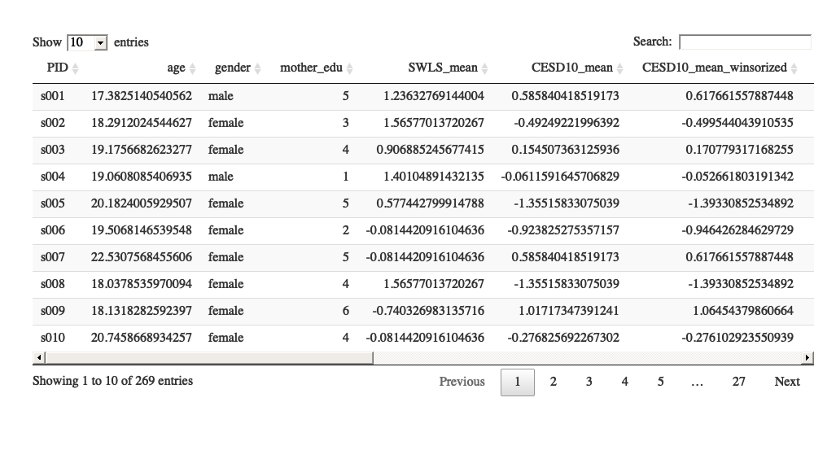
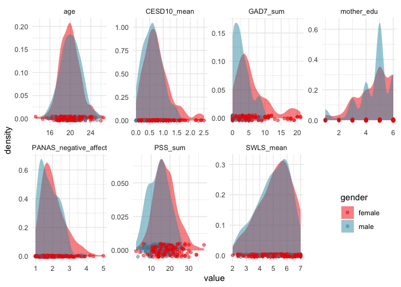

This tutorial was presented at the University of Oregon Developmental
Seminar, May 3, 2019.

The repository can be found at:
<https://github.com/dcosme/specification-curves/>

background
==========

-   The problem: there are many different ways to test a model and we
    usually only report one or a few specifications. Model selection
    relies on choices by the researcher and these are often artbitrary
    and sometimes driven by a desire for significant results.
-   The solution (according to [Simonsohn, Simmons, & Nelson,
    2015](https://papers.ssrn.com/sol3/papers.cfm?abstract_id=2694998):
    specify all “reasonable” models and assess the distribution of
    effects

**Figure 1 Simonsohn, Simmons, & Nelson, 2015** 

steps for conducting SCA
------------------------

1.  Specify all reasonable models
2.  Plot specification curve showing estimates/model fits as a function
    of analytic decisions or model parameters
3.  Test how consistent the curve results are against a null hypothesis

1. Reasonable specifications should be:
---------------------------------------

-   Consistent with theory
-   Expected to be statistically valid
-   Non-redundant

**Table 1 Simonsohn, Simmons, & Nelson, 2015** 

2. Descriptive specification curve
----------------------------------

**Figure 2 Simonsohn, Simmons, & Nelson, 2015** 

3. Inferential statistics
-------------------------

-   Use permutation testing to run many specification curve analyses and
    create a null distribution
-   Potential questions to test versus null:
    -   Is the median effect size in the observed curve statistically
        different than in the null distribution?
    -   Is the share of dominant signs (e.g., positive or negative
        effects) different than the null?
    -   Is the share of dominant signs that are statistically
        significant different than the null?

**Table 2 Simonsohn, Simmons, & Nelson, 2015**  


-   Also possible to compare specification surves between two variables
    of interest

**Figure 6 Orben & Przybylski, 2019** 

examples
========

-   [Run All the Models! Dealing With Data Analytic Flexibility - Julia
    Rohrer](https://www.psychologicalscience.org/observer/run-all-the-models-dealing-with-data-analytic-flexibility)
-   [The association between adolescent well-being and digital
    technology use - Orben & Przybylski,
    2019](https://www.amyorben.com/pdf/2019_orbenprzybylski_nhb.pdf)
-   [Screens, Teens, and Psychological Well-Being: Evidence From Three
    Time-Use-Diary Studies - Orben & Przybylski,
    2019](https://www.amyorben.com/pdf/2019_orbenprzybylski_ps.pdf)

reading list
============

-   [Specification Curve: Descriptive and Inferential Statistics on All
    Reasonable Specifications - Simonsohn, Simmons, & Nelson,
    2015](https://papers.ssrn.com/sol3/papers.cfm?abstract_id=2694998)

programming resources
=====================

-   [EDUC 610, Functional Programming with R - Daniel
    Anderson](https://uo-datasci-specialization.github.io/c3-fun_program_r/schedule.html)
-   [R for Data Science - Grolemund &
    Wickham](https://r4ds.had.co.nz/many-models.html)

load packages
=============

``` r
if (!require(tidyverse)) {
  install.packages('tidyverse')
}
if (!require(purrr)) {
  install.packages('purrr')
}
if (!require(broom)) {
  install.packages('broom')
}
if (!require(cowplot)) {
  install.packages('cowplot')
}
if (!require(combinat)) {
  install.packages('combinat')
}
devtools::install_github("dcosme/specr", ref = "plotmods")
library(specr)
```

1. Define reasonable specifications
===================================

Research question:

What is the relationship between mental health and satisfaction with
life?

### Ways of operationalizing of the IV “mental health”

-   `CEDS10_mean` = mean depression score on the CESD-10
-   `GAD7_sum` = summed anxiety score on the GAD-7
-   `PANAS_negative_Affect` = mean negative affect score on the PANAS-X
-   `PSS_sum` = summed perceived stress score on the PSS

### Control variables

-   `age` = age
-   `gender` = gender
-   `mother_edu` = maternal education

### Analytic decisions

-   statistical modeling approach
    -   linear regression
-   outliers
    -   use all data points
    -   winsorize to the mean +/- 3 SD

load and tidy data
------------------

-   create winsorized independent variables (+/- 3 SD from the mean)
-   mean center and standardize each variable

``` r
df = read.csv("~/Documents/code/dsnlab/FP_scripts/behavioral/self_report/scored_full_sample.csv") %>%
  filter(grepl("T1", survey_name)) %>%
  filter(scored_scale %in% c("age", "gender", "mother edu") | scale_name %in% c("CESD-10", "GAD7", "PANAS", "PSS", "SWLS")) %>%
  unite(scale_name, scale_name, scored_scale) %>%
  mutate(scale_name = gsub("CVS_", "", scale_name),
         scale_name = gsub(" ", "_", scale_name),
         SID = gsub("FP", "s", SID),
         SID = as.factor(SID)) %>%
  select(SID, scale_name, score) %>%
  spread(scale_name, score) %>%
  select(-GAD7_difficulty, -PANAS_positive_affect) %>%
  mutate(gender = ifelse(gender == 1, "female", "male"),
         gender = as.factor(gender)) %>%
  rename("CESD10_mean" = `CESD-10_mean`,
         "PID" = SID)

df$age = rnorm(nrow(df), mean = 20, sd = 2) # make up ages

model_df = df %>%
  gather(variable, value, -PID, -age, -gender, -mother_edu, -SWLS_mean) %>%
  group_by(variable) %>%
  mutate(mean_value = mean(value, na.rm = TRUE),
         sd3 = 3*sd(value, na.rm = TRUE)) %>%
  ungroup() %>%
  mutate(value_winsorized = ifelse(value > mean_value + sd3, mean_value + sd3,
                            ifelse(value < mean_value - sd3, mean_value - sd3, value)),
         variable_winsorized = sprintf("%s_winsorized", variable)) %>%
  select(-mean_value, -sd3) %>%
  spread(variable_winsorized, value_winsorized) %>%
  group_by(PID) %>%
  fill(contains("winsorized"), .direction = "downup") %>%
  spread(variable, value) %>%
  gather(variable, value, -PID, -age, -gender, -mother_edu) %>%
  group_by(variable) %>%
  mutate(value = scale(value, center = TRUE, scale = TRUE)) %>%
  spread(variable, value) %>%
  select(PID, age, gender, mother_edu, SWLS_mean, sort(tidyselect::peek_vars()))

model_df %>%
  DT::datatable(rownames = FALSE, extensions = 'FixedColumns', 
                    options = list(scrollX = TRUE,
                                   scrollY = TRUE,
                                   fixedColumns = list(leftColumns = 1)))
```



plot distributions
------------------

``` r
palette = wesanderson::wes_palette("Zissou1", 2, "continuous")

df %>%
  filter(!is.na(gender)) %>%
  gather(variable, value, -PID, -gender) %>%
  ggplot(aes(value, fill = gender, color = gender)) +
  geom_density(alpha = .5, color = NA) +
  geom_jitter(aes(value, y = 0), height = .005, alpha = .5) + 
  facet_wrap(~variable, scales = "free", nrow = 2) +
  scale_fill_manual(values = c(palette[2], palette[1])) +
  scale_color_manual(values = c(palette[2], palette[1])) +
  theme_minimal() +
  theme(legend.position = c(.9, .2))
```



2. Specify and run models
=========================

There are various methods for running a large number of model
specifications.

Here, we unpack 3 different methods and discuss the advantages and
disadvantages.

run all nested models using `dredge` from `MuMIn`
-------------------------------------------------

Advantages \* easily runs all nested models from a maximal model

Disadvantages / limitations \* the max number of predictors = 30 \* NAs
must be omitted across all model specifications \* doesn’t give
parameter estimates for factors directly; you need to extract them using
`MuMIn::get.models()` \* it may run nested models you aren’t interested
in

``` r
# set na.action for dredge
options(na.action = "na.fail")

# omit NAs
model_df_na = model_df %>% 
  select(SWLS_mean, CESD10_mean, CESD10_mean_winsorized, age, gender, mother_edu) %>%
  na.omit()

# run full model
full_model = lm(SWLS_mean ~ CESD10_mean + age + gender + mother_edu, data = model_df_na)

# run all possible nested models
(all_models = MuMIn::dredge(full_model, rank = "AIC", extra = "BIC"))
```

    ## Global model call: lm(formula = SWLS_mean ~ CESD10_mean + age + gender + mother_edu, 
    ##     data = model_df_na)
    ## ---
    ## Model selection table 
    ##         (Int)      age CES_men gnd  mth_edu   BIC df   logLik   AIC delta
    ## 7   0.0847400          -0.4895   +          710.8  4 -344.204 696.4  0.00
    ## 8   0.3953000 -0.01559 -0.4895   +          716.0  5 -344.037 698.1  1.66
    ## 15  0.0618500          -0.4882   + 0.004937 716.3  5 -344.198 698.4  1.99
    ## 16  0.3704000 -0.01578 -0.4880   + 0.006188 721.6  6 -344.027 700.1  3.64
    ## 3  -0.0046530          -0.4654              711.4  3 -347.318 700.6  4.23
    ## 4   0.3625000 -0.01838 -0.4658              716.5  4 -347.090 702.2  5.77
    ## 11 -0.0458600          -0.4633     0.008948 716.9  4 -347.297 702.6  6.18
    ## 12  0.3209000 -0.01869 -0.4633     0.010380 722.1  5 -347.061 704.1  7.71
    ## 9  -0.3530000                      0.076480 772.5  3 -377.845 761.7 65.28
    ## 1  -0.0006238                               769.4  2 -379.105 762.2 65.80
    ## 13 -0.3179000                    + 0.076340 777.3  4 -377.473 762.9 66.54
    ## 10  0.0107300 -0.01853             0.077910 777.7  4 -377.661 763.3 66.91
    ## 5   0.0339500                    +          774.2  3 -378.732 763.5 67.06
    ## 2   0.3213000 -0.01612                      774.7  3 -378.967 763.9 67.53
    ## 14  0.0231400 -0.01743           + 0.077680 782.6  5 -377.310 764.6 68.21
    ## 6   0.3330000 -0.01501           +          779.6  4 -378.612 765.2 68.82
    ##    weight
    ## 7   0.452
    ## 8   0.197
    ## 15  0.168
    ## 16  0.073
    ## 3   0.055
    ## 4   0.025
    ## 11  0.021
    ## 12  0.010
    ## 9   0.000
    ## 1   0.000
    ## 13  0.000
    ## 10  0.000
    ## 5   0.000
    ## 2   0.000
    ## 14  0.000
    ## 6   0.000
    ## Models ranked by AIC(x)

``` r
# return na.action options to exclude
options(na.action = "na.exclude")
```

run multiple models directly using `purrr`
------------------------------------------

[`purrr`](https://purrr.tidyverse.org/index.html) is an amazing package
for functional programming and is super useful to running numeous model
specifications.

Advantages \* greater control over how models are specified

Disadvantages / limitations \*

Note that if you are running linear mixed effects models, you can use
the `broom.mixed` instead of the `broom` package to tidy the model
output.

``` r
# define function to convert the model components into a formula
convert_formula = function(x, y, controls, ...) {
  if (controls == "no covariates") {
    paste(y, "~", x)    
  } else {
    paste(y, "~", x, "+", controls)
  }
}

# specify model components
dvs = "SWLS_mean"
ivs = names(model_df)[!names(model_df) %in% c("PID", "age", "gender", "mother_edu", "SWLS_mean")]
control_vars = c("age", "gender", "mother_edu")
model = "lm"

# generate all combinations of control variables
control_list = controls = do.call(c, lapply(1:length(control_vars), function(x) combinat::combn(control_vars, x, simplify = FALSE))) %>%
  purrr::map(function(x) paste(x, collapse = " + ")) %>%
  unlist() %>%
  append(., "no covariates")

# generate model specifications from model components
models = expand.grid(x = ivs,
                     y = dvs,
                     model = model,
                     controls = control_list, stringsAsFactors = FALSE) %>%
  tibble()

# run models and extract parameter estimates and stats
output_purrr = models %>%
  mutate(formula = pmap(models, convert_formula)) %>%
  unnest(formula) %>%
  mutate(fit = map2(model,
                    formula,
                    ~ do.call(.x, list(data = model_df, formula = .y)))) %>%
  mutate(coefs = map(fit,
                     broom::tidy,
                     conf.int = TRUE,
                     conf.level = .95),
         obs = map(fit, nobs)) %>%
  unnest(coefs) %>%
  unnest(obs) %>%
  filter(term == x) %>%
  select(model, y, x, controls, formula, everything(), -term, -fit) 
```

run models using the `specr` package
------------------------------------

[`specr`](https://masurp.github.io/specr/) is a package specifically
built for conducting specification curve analysis and utilizes `purrr`
in its functions.

Advantages \* very simple to use! \* you can easily run the models in
specific subsets of your data

Disadvantages / limitations \* does not run all possible combinations of
control variables \* without modification, it does not currently handle
multilevel modeling (I’m using a [modified version
here](https://github.com/dcosme/specr/tree/plotmods))

``` r
output_specr = run_specs(df = model_df,
                             y = dvs, 
                             x = ivs,
                             controls = control_vars,
                             model = model, 
                             subsets = NULL)
```

3. plot specification curve
===========================

Guide to unpacking the curve

-   Panel A = model fit of each model specification
-   Panel B = variables included in each model specification
-   Null model (intercept only) is highlighted in blue
-   Models with lower AIC values than the null model are highlighted in
    red

homebrew plotting with `purrr` output
-------------------------------------

-   red = statistically significant values at p \< .05
-   black = p \> .05

``` r
# set plot aesthetics
aes = theme_minimal(base_size = 11) +
      theme(legend.title = element_text(size = 10),
          legend.text = element_text(size = 9),
          axis.text = element_text(color = "black"),
          axis.line = element_line(colour = "black"),
          legend.position = "none",
          panel.grid.major = element_blank(),
          panel.grid.minor = element_blank(),
          panel.border = element_blank(),
          panel.background = element_blank())

# merge and tidy for plotting
plot_data = output_purrr %>%
  arrange(estimate) %>%
  mutate(specification = row_number(),
         winsorized = ifelse(grepl("winsorized", x), "yes", "no"),
         significant.p = ifelse(p.value < .05, "yes", "no"),
         x = gsub("_winsorized", "", x)) 

# plot top panel
top = plot_data %>%
  ggplot(aes(specification, estimate, color = significant.p)) +
    geom_pointrange(aes(ymin = conf.low, ymax = conf.high), size = .25, shape = "", alpha = .5) +
    geom_point(size = .5) +
    scale_color_manual(values = c("yes" = "red", "no" = "black")) + 
    labs(x = "", y = "standardized\nregression coefficient\n") + 
    aes

# rename variables and plot bottom panel
for (var in c(control_vars, "no covariates")) {
  plot_data = plot_data %>%
    mutate(!!var :=  ifelse(grepl(var, controls), "yes", "no"))
}

bottom = plot_data %>%
  gather(controls, control_value, eval(control_vars), `no covariates`) %>% 
  gather(variable, value, x, controls, winsorized) %>%
  filter(control_value == "yes") %>%
  unique() %>%
  mutate(variable = factor(variable, levels = c("x", "winsorized", "controls"))) %>% 
  ggplot(aes(x = specification,
             y = value,
             color = significant.p)) +
    geom_point(aes(x = specification,
                   y = value),
               shape = 124,
               size = 3) +
    facet_grid(variable ~ 1, scales = "free_y", space = "free_y") +
    #scale_color_manual(values = c("yes" = "red", "no" = "black")) + 
    labs(x = "\nspecification number", y = "") + 
    aes +
    theme(strip.text.x = element_blank())
        
# join panels
cowplot::plot_grid(top, bottom, ncol = 1, align = "v", axis = 'l',
                       labels = c('A', 'B'), rel_heights = c(.35, .65))
```


plotting with `specr`
---------------------

4. inferential statistics
=========================
